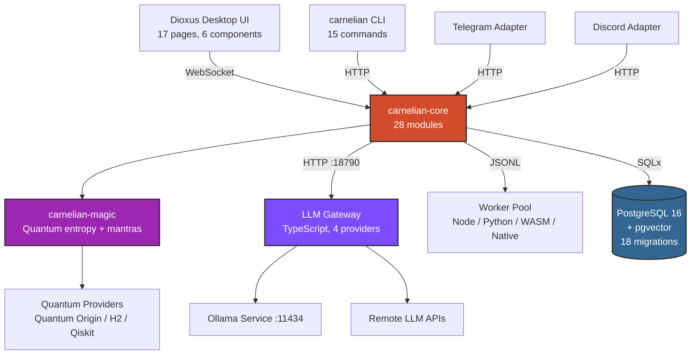
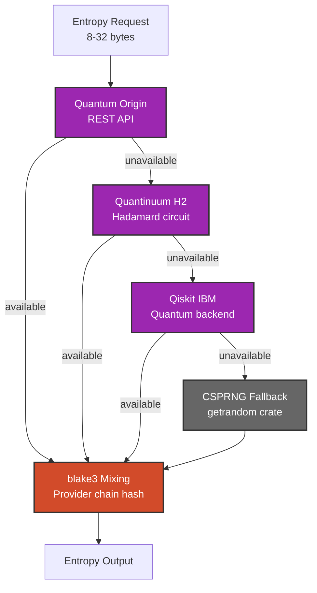
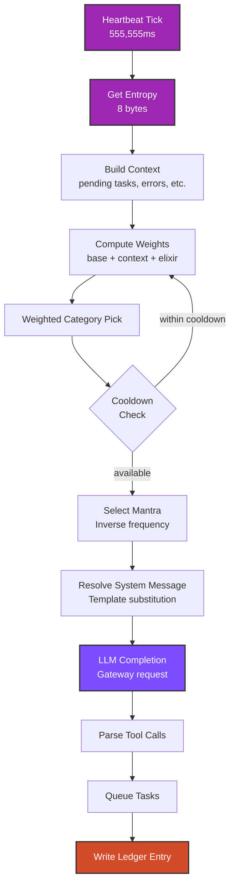
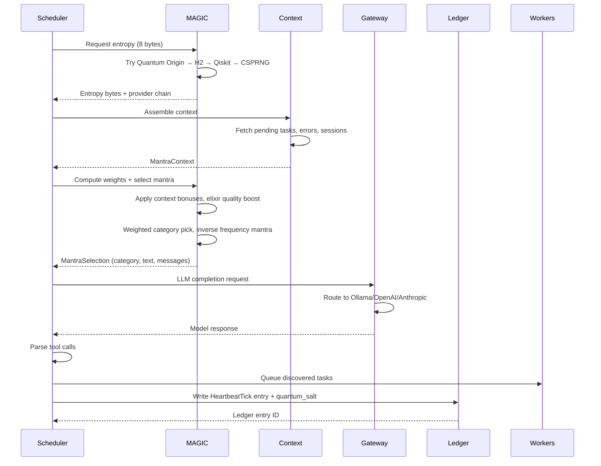

<p align="center">
  
</p>

<p align="center">
  <a href="https://github.com/kordspace/carnelian/actions/workflows/ci.yml"></a>
  <a href="https://github.com/kordspace/carnelian"></a>
  <a href="https://github.com/kordspace/carnelian"></a>
  <a href="https://github.com/kordspace/carnelian"></a>
</p>

<p align="center">An AI workspace harness built in Rust — orchestrating autonomous agents with capability-based security, event-stream architecture, and local-first execution.</p>

<p align="center">
  <strong>Copyright © 2024-2026 Marco Julio Lopes and Kordspace LLC</strong><br>
  <a href="LICENSE.md">Proprietary License</a> | Patent Pending
</p>

> 💎 *Carnelian Core provides the foundational infrastructure for AI agent orchestration, task execution, and workspace automation. Think of it as the runtime and security layer that makes autonomous AI agents safe, auditable, and productive.*

## Brand Identity

| Symbol | Name | Role |
|--------|------|------|
| 🔥 | **Carnelian Core** | AI workspace harness — the runtime that orchestrates agents |
| 🦎 | **Lian** | Agent personality — the spirit that reasons and decides |
| 💎 | **Carnelian Core** | Architectural guarantees — security, ledger, auditability |
| 🔮 | **MAGIC** | Quantum intelligence layer — entropy, mantras, optimization |

### Brand Assets

- **Logo**: [`assets/logos/carnelian-logo.svg`](assets/logos/carnelian-logo.svg) — Full logo with wordmark
- **Icon**: [`assets/logos/carnelian-icon.svg`](assets/logos/carnelian-icon.svg) — Icon only (16×16 to 256×256)
- **Wordmark**: [`assets/logos/carnelian-wordmark.svg`](assets/logos/carnelian-wordmark.svg) — Text only
- **Color Palette**: [`assets/branding/color-palette.md`](assets/branding/color-palette.md) — Brand colors and usage guidelines

See [docs/BRAND.md](docs/BRAND.md) for the complete dual-theme brand kit (Forge/Night Lab).

## Overview

🔥 **Carnelian Core** is an AI workspace harness built in Rust that provides the foundational infrastructure for autonomous agent orchestration. It combines capability-based security, event-stream architecture, and local-first LLM execution to create a safe, auditable environment for AI-driven task automation.

**Core Value Proposition:**
- **Workspace Automation** — Autonomous task discovery, scheduling, and execution
- **Security First** — Capability-based deny-by-default security with tamper-resistant audit trails
- **Local-First AI** — Ollama integration for on-device inference with cloud fallback
- **Production Ready** — Event-stream architecture, worker sandboxing, and resource controls
- **Extensible** — 50+ skills with bulk import tooling via multi-runtime worker system (Node.js, Python, WASM, native Rust)

## Features

CARNELIAN is a production-ready AI workspace harness with comprehensive capabilities:

**Core Infrastructure**
- ✅ Core orchestrator (Axum/Tokio), CLI, HTTP API, event stream
- ✅ Policy engine, blake3 ledger, scheduler, worker transport
- ✅ PostgreSQL 16 with pgvector, SQLx migrations
- ✅ 262+ passing tests with 120+ integration tests

**Task Execution & Skills**
- ✅ Multi-runtime worker system (Node.js, Python, WASM, native Rust)
- ✅ 50+ skills with bulk import tooling — full compatibility via Node worker, with WASM/native targets for new skills
- ✅ Skill discovery with blake3 checksums and file watching
- ✅ XP progression system with 1.172-exponent level curve

**Intelligence & Context**
- ✅ Soul management and session lifecycle
- ✅ Memory retrieval with pgvector similarity search
- ✅ Context assembly and compaction pipeline
- ✅ Model routing with TypeScript LLM Gateway
- ✅ Agentic execution with heartbeat system (555,555ms)

**Security & Compliance**
- ✅ Capability-based security (deny-by-default)
- ✅ Approval queue for human-in-the-loop workflows
- ✅ Safe mode emergency lockdown
- ✅ Ed25519 attestations and encryption at rest
- ✅ Ledger signatures and chain anchoring

**Advanced Features**
- ✅ Sub-agents and workflow orchestration
- ✅ Telegram + Discord adapters with pairing
- ✅ Voice gateway (ElevenLabs STT/TTS)
- ✅ 🧪 Elixir system for knowledge persistence
- ✅ Skill Book catalog with activation flow

**Desktop UI** (In Development)
- 🚧 Dioxus desktop UI — 17 pages, 6 components
- 🚧 WebSocket event streaming
- � Real-time metrics and monitoring

## Why Carnelian Core?

**Built for Production AI Workflows:**
- **Rust Foundation** — Performance, memory safety, and reliability
- **Capability-Based Security** — Deny-by-default with explicit grants and audit trails
- **Event-Stream Architecture** — Backpressure handling, bounded buffers, no UI freezes
- **Worker Sandboxing** — Isolated execution with resource controls
- **Local-First LLMs** — Ollama integration with GPU support and cloud fallback
- **Multi-Runtime Support** — Node.js, Python, WASM, and native Rust workers
- **Autonomous Operation** — Heartbeat system (555,555ms), task discovery, auto-queueing
- **Tamper-Resistant Ledger** — blake3 hash-chain for privileged action audit trail

## Architecture

The following diagram illustrates the full system architecture showing all components and their interactions.



### Key Components

| Component | Technology | Description |
|-----------|------------|-------------|
| **Core Orchestrator** | Axum/Tokio/SQLx | HTTP API, WebSocket events, task scheduling |
| **Desktop UI** | Dioxus | Native desktop interface — 17 pages, 6 components |
| **Policy Engine** | Rust (`policy.rs`) | Capability-based security, deny-by-default |
| **MAGIC Core** | Rust (`carnelian-magic/`) | Quantum entropy provider chain, mantra matrix, blake3 mixing |
| **Worker Manager** | Rust (`worker.rs`) | Worker lifecycle, JSONL transport, capability grants |
| **Node Worker** | Node.js/TypeScript | 50+ active skills, full compatibility |
| **Python Worker** | Python 3.10+ | ML/data science skills, Playwright automation |
| **WASM Worker** | wasmtime 27, WASI P1 (`wasm_runtime.rs`) | Sandboxed WASM skill execution, epoch timeout, capability-gated fs/network |
| **Native Ops Worker** | Rust inline (`carnelian-worker-native/`) | In-process ops: git_status, file_hash (blake3), docker_ps (bollard), dir_list (walkdir) |
| **Ledger Manager** | Rust (`ledger.rs`) | blake3 hash-chain audit trail for privileged actions |
| **Scheduler** | Rust (`scheduler.rs`) | Priority-based task queue, retry policies, heartbeat |
| **Agentic Loop** | Rust (`agentic.rs`) | Heartbeat agentic turn, compaction pipeline |
| **Session Manager** | Rust (`session.rs`) | Session lifecycle, context assembly |
| **Memory Manager** | Rust (`memory.rs`) | Memory retrieval, pgvector similarity search |
| **Soul Manager** | Rust (`soul.rs`) | Soul file management, personality state |
| **Model Router** | Rust (`model_router.rs`) | LLM provider routing and fallback |
| **LLM Gateway** | TypeScript (`:18790`) | Unified gateway — Ollama, OpenAI, Anthropic, Fireworks |
| **Approval Queue** | Rust (`approvals.rs`) | Human-in-the-loop approval workflow |
| **Safe Mode** | Rust (`safe_mode.rs`) | Emergency lockdown, capability suspension |
| **Attestation** | Rust (`attestation.rs`) | Worker identity verification, Ed25519 signatures |
| **Encryption** | Rust (`encryption.rs`, `crypto.rs`) | Encryption at rest, key management |
| **Chain Anchor** | Rust (`chain_anchor.rs`) | Ledger chain integrity anchoring |
| **Channel Adapters** | Rust (`carnelian-adapters/`) | Telegram + Discord bots with pairing, rate limiting |
| **Voice Gateway** | Rust (`voice.rs`) | ElevenLabs STT/TTS integration |
| **XP System** | Rust (`xp.rs`, `metrics.rs`) | 1.172-exponent level curve, leaderboard, skill metrics |
| **Sub-Agents** | Rust (`sub_agent.rs`) | Delegated agent execution |
| **Workflows** | Rust (`workflow.rs`) | Multi-step workflow orchestration |

## Worker Architecture

Carnelian uses a multi-runtime worker system for skill execution:

| Worker | Runtime | Use Case | Status |
|--------|---------|----------|--------|
| **Node Worker** | Node.js/TypeScript | 50+ active skills, full compatibility, npm ecosystem | ✅ Built |
| **Python Worker** | Python 3.10+ | ML/data science, Playwright automation | ✅ Built |
| **WASM Worker** | WebAssembly (wasmtime 27 + WASI P1) | Sandboxed Rust/C/TinyGo skills | ✅ Built |
| **Native Ops Worker** | Rust inline (no subprocess) | `git_status`, `file_hash`, `docker_ps`, `dir_list` | ✅ Built |

All existing skills (50+ active, 600+ in migration queue) run unchanged through the Node worker, ensuring full backward compatibility while migrating to the Rust core. New skills should target WASM for portability and sandboxing.

## Skill Book

Carnelian includes a curated **Skill Book** — a catalog of pre-integrated, standardized skills ready for immediate activation. Each skill follows a standardized onboarding flow with required API tokens, sandbox configurations, and capability declarations.

**Seven Categories:**
- **Code** — skills for reading, analyzing, and modifying code (read_file, search_code, run_tests)
- **Research** — web search, documentation lookup, academic paper retrieval
- **Communication** — send message, schedule meeting, draft email
- **Creative** — image generation, audio synthesis, copywriting
- **Data** — query databases, transform datasets, generate reports
- **Automation** — browser automation, API orchestration, scheduled tasks
- **Quantum** — quantum entropy generation, optimization, and circuit-based skills (quantinuum-h2-rng, qiskit-rng, quantum-optimize)

**Skill Activation Flow:**
1. Open Skills panel → Skill Book tab
2. Browse or search for desired skill
3. Click **Activate** and provide required API tokens
4. Tokens stored encrypted in config vault
5. Skill immediately available in registry

## CLI

The `carnelian` binary provides a full command-line interface:

```bash
carnelian start                    # Start the orchestrator
carnelian start --log-level DEBUG  # Start with debug logging
carnelian status                   # Check if running
carnelian stop                     # Stop gracefully
carnelian migrate                  # Run database migrations
carnelian migrate --dry-run        # Show pending migrations
carnelian logs                     # Stream events from running instance
carnelian logs -f --level ERROR    # Stream only ERROR events
carnelian skills refresh           # Scan registry and sync skills to database
carnelian task create "Task title"                           # Create a task
carnelian task create "Task" --description "Details"         # With description
carnelian task create "Task" --skill-id <uuid> --priority 5  # With skill and priority
carnelian magic auth               # Authenticate with Quantinuum
carnelian magic auth --refresh     # Refresh tokens
carnelian magic status             # Show provider health
carnelian magic sample             # Sample 32 quantum-random bytes
carnelian magic providers          # List configured providers
```

Global flags: `--database-url`, `--config`, `--log-level`, `--port`.
The `--url` flag can be used with `task` commands to specify a remote server URL (e.g., `carnelian task --url http://remote:18789 create "Task"`).

See [docs/CHECKPOINT1.md](docs/CHECKPOINT1.md) for the checkpoint validation guide including manual steps and demo recording.

## API Endpoints

All endpoints are prefixed with `/v1`.

### System

| Method | Path | Description |
|--------|------|-------------|
| `GET` | `/v1/health` | Health check (database connectivity, version) |
| `GET` | `/v1/status` | System status |
| `GET` | `/v1/metrics` | Performance metrics (latency percentiles, throughput) |
| `POST` | `/v1/events` | Publish an event |
| `GET` | `/v1/events/ws` | WebSocket event stream |

### Tasks

| Method | Path | Description |
|--------|------|-------------|
| `POST` | `/v1/tasks` | Create a new task |
| `GET` | `/v1/tasks` | List tasks |
| `GET` | `/v1/tasks/{task_id}` | Get task details |
| `POST` | `/v1/tasks/{task_id}/cancel` | Cancel a task |
| `GET` | `/v1/tasks/{task_id}/runs` | List runs for a task |

### Runs

| Method | Path | Description |
|--------|------|-------------|
| `GET` | `/v1/runs/{run_id}` | Get run details |
| `GET` | `/v1/runs/{run_id}/logs` | Get paginated run logs |

### Skills

| Method | Path | Description |
|--------|------|-------------|
| `GET` | `/v1/skills` | List registered skills |
| `POST` | `/v1/skills/{skill_id}/enable` | Enable a skill |
| `POST` | `/v1/skills/{skill_id}/disable` | Disable a skill |
| `POST` | `/v1/skills/refresh` | Refresh skill registry |

## Prerequisites

### Required
- **Rust 1.85+** - Install from [rustup.rs](https://rustup.rs)
- **Docker & Docker Compose** - For PostgreSQL and Ollama
- **Git** - Version control

### For GPU Support
- **NVIDIA GPU** - RTX 2080 or better recommended
- **NVIDIA Container Toolkit** - For GPU passthrough to Docker

### For Workers
- **Node.js 18+** - For Node.js worker (600+ skills)
- **Python 3.10+** - For Python worker

### For Development
- **prek** - Pre-commit hooks: `cargo install prek`
- **sqlx-cli** - Database migrations: `cargo install sqlx-cli`

### Platform-Specific Setup Guides

- **[Windows (WSL2)](docs/SETUP_WINDOWS.md)** — WSL2, GPU passthrough, Docker Desktop, performance tips
- **[macOS](docs/SETUP_MACOS.md)** — Homebrew, Apple Silicon notes, CPU-only Ollama
- **[Linux (Ubuntu/Debian)](docs/SETUP_LINUX.md)** — NVIDIA Container Toolkit, systemd service, headless server

## Installation

### Quick Start

```bash
# 1. Clone repository
git clone https://github.com/kordspace/carnelian.git
cd carnelian

# 2. Build the project
cargo build --release

# 3. Run the interactive setup wizard (detects GPU, configures Docker, sets up database)
carnelian init

# 4. Start the system
carnelian start
```

> **CI/Headless:** For automated deployments, use `carnelian init --non-interactive`. See [docs/INSTALL.md](docs/INSTALL.md) for detailed installation options, troubleshooting, and platform-specific guides.

See [docs/DEVELOPMENT.md](docs/DEVELOPMENT.md) for detailed setup and development workflow.

## Machine Profiles

| Profile | GPU | VRAM | RAM | Recommended Model | Notes |
|---------|-----|------|-----|-------------------|-------|
| **Standard** | RTX 2080 Super (8GB VRAM) | 32GB | `deepseek-r1:7b` |
| **Performance** | RTX 3090 (24GB VRAM) | 64GB+ | `deepseek-r1:32b` or `deepseek-r1:70b` | High-end profile for production workloads |

Profiles affect Docker resource limits and worker concurrency settings. See [docker-compose.yml](docker-compose.yml) and [machine.toml.example](machine.toml.example) for configuration.

## Project Structure

```
carnelian/
├── crates/
│   ├── carnelian-core/           # Core orchestrator (Axum server, scheduler, policy, ledger, workers)
│   │   ├── src/
│   │   │   ├── bin/carnelian.rs  # CLI binary (start, stop, status, migrate, logs)
│   │   │   ├── server.rs         # HTTP API + WebSocket server
│   │   │   ├── scheduler.rs      # Task queue, priority scheduling, retry policies
│   │   │   ├── worker.rs         # Worker manager, JSONL transport, process lifecycle
│   │   │   ├── events.rs         # Event stream with backpressure and bounded buffers
│   │   │   ├── policy.rs         # Capability-based security engine
│   │   │   ├── ledger.rs         # blake3 hash-chain audit trail
│   │   │   ├── skills.rs         # Skill discovery, manifest validation, file watcher
│   │   │   ├── skills/
│   │   │   │   └── wasm_runtime.rs  # WASM skill runtime (wasmtime + WASI P1)
│   │   │   ├── agentic.rs        # Agentic loop, heartbeat turn, compaction pipeline
│   │   │   ├── approvals.rs      # Approval queue, human-in-the-loop
│   │   │   ├── attestation.rs    # Worker attestation, Ed25519 verification
│   │   │   ├── chain_anchor.rs   # Ledger chain anchoring
│   │   │   ├── context.rs        # Context assembler
│   │   │   ├── crypto.rs         # Cryptographic primitives
│   │   │   ├── encryption.rs     # Encryption at rest
│   │   │   ├── memory.rs         # Memory retrieval and storage
│   │   │   ├── metrics.rs        # Performance metrics
│   │   │   ├── model_router.rs   # LLM provider routing
│   │   │   ├── safe_mode.rs      # Safe mode / emergency lockdown
│   │   │   ├── session.rs        # Session lifecycle
│   │   │   ├── soul.rs           # Soul file management
│   │   │   ├── sub_agent.rs      # Sub-agent delegation
│   │   │   ├── workflow.rs       # Workflow orchestration
│   │   │   ├── xp.rs             # XP manager, level curve, skill metrics
│   │   │   ├── voice.rs          # Voice gateway, ElevenLabs STT/TTS
│   │   │   ├── db.rs             # Database connection and migrations
│   │   │   └── providers/        # Rust provider modules (ollama, openai, anthropic, fireworks)
│   │   └── tests/                # 10+ test suites, 120+ tests
│   ├── carnelian-common/         # Shared types, error handling, API models
│   ├── carnelian-ui/             # Dioxus desktop UI (17 pages)
│   │   └── src/
│   │       ├── components/
│   │       │   ├── xp_widget.rs       # XP progress bar and recent events
│   │       │   ├── voice_settings.rs  # Voice configuration panel
│   │       │   ├── top_bar.rs         # Top navigation bar
│   │       │   ├── toast.rs           # Toast notifications
│   │       │   ├── tab_nav.rs         # Tab navigation
│   │       │   └── system_tray.rs     # System tray integration
│   │       └── pages/
│   │           ├── dashboard.rs       # Main dashboard
│   │           ├── tasks.rs           # Task management
│   │           ├── skills.rs          # Skill registry
│   │           ├── providers.rs       # LLM provider config
│   │           ├── identity.rs        # Identity management
│   │           ├── heartbeat.rs       # Heartbeat settings
│   │           ├── events.rs          # Event stream view
│   │           ├── sub_agents.rs      # Sub-agent management
│   │           ├── channels.rs        # Channel adapters (Telegram/Discord)
│   │           ├── capabilities.rs    # Capability grants
│   │           ├── approvals.rs       # Approval queue UI
│   │           ├── workflows.rs       # Workflow management
│   │           ├── xp_progression.rs  # XP progression dashboard
│   │           ├── magic.rs           # MAGIC quantum entropy & mantras
│   │           ├── elixirs.rs         # Elixir knowledge persistence
│   │           ├── ledger.rs          # Ledger audit trail viewer
│   │           └── settings.rs        # System settings
│   ├── carnelian-adapters/       # Channel adapters (Telegram, Discord)
│   ├── carnelian-magic/          # 🔮 Quantum entropy + mantra system
│   ├── carnelian-worker-node/    # Node.js worker wrapper crate
│   ├── carnelian-worker-python/  # Python worker wrapper crate
│   └── carnelian-worker-native/  # Rust named ops (git, blake3, docker, dir)
├── gateway/                      # TypeScript LLM Gateway (:18790)
│   └── src/
│       ├── server.ts             # Express server, routing
│       ├── router.ts             # Provider selection logic
│       ├── providers/
│       │   ├── ollama.ts         # Ollama provider
│       │   ├── openai.ts         # OpenAI provider
│       │   ├── anthropic.ts      # Anthropic provider
│       │   └── fireworks.ts      # Fireworks provider
│       └── types.ts              # Gateway type definitions
├── workers/
│   ├── node-worker/              # Node.js/TypeScript worker (50+ skills)
│   └── python-worker/            # Python worker
├── skills/
│   ├── registry/                 # Skill bundles and manifests
│   └── skill-book/               # Curated catalog (7 categories, 30+ skills)
│       └── quantum/              # quantinuum-h2-rng, qiskit-rng, quantum-optimize
├── db/
│   └── migrations/               # SQL migrations (18 migration files, PostgreSQL 16 + pgvector)
├── docs/                         # Documentation (development, docker, brand, logging)
├── scripts/
│   ├── setup-hooks.sh            # Development environment setup
│   └── ci-local.sh               # Local CI validation script
└── .github/workflows/ci.yml      # CI pipeline (lint, build, test, integration, secrets)
```

## Key Features

- **Capability-Based Security** - Deny-by-default with explicit grants, owner-signed Ed25519 authority
- **Event-Stream Architecture** - Priority-based sampling, bounded buffers, WebSocket streaming
- **Local-First Inference** - Ollama integration with GPU support, remote fallback
- **Heartbeat System** - 555,555ms wake routine with mantra rotation, auto-task queuing
- **Worker Sandboxing** - Isolated process execution with JSONL transport protocol
- **Tamper-Resistant Ledger** - blake3 hash-chain audit trail for integrity verification
- **50+ Skills with bulk import tooling** - Full compatibility via Node worker, with WASM/native targets for new skills
- 🔮 **Quantum-Grade Entropy** - Quantum Origin REST API, Quantinuum H2 Hadamard circuit, and Qiskit IBM, with CSPRNG fallback
- 🧪 **Elixir Knowledge Persistence** - RAG-based retrieval with pgvector, quality scoring (0–100), and XP integration
- 🎮 **XP / Leveling System** - Level 1–99 exponential curve (1.172 exponent), ledger-backed event history, leaderboard
- **Task Lifecycle** - Priority-based scheduling, concurrency limits, configurable retry policies
- **LZ4 Compression** - Database column compression for large payloads (memories, logs, metadata)
- **Skill Discovery** - Automatic filesystem watching with blake3 checksums and database sync
- **Voice Gateway** - ElevenLabs STT/TTS integration with encrypted API key storage

## Workspace Scanning & Auto-Queueing

Carnelian automatically discovers tasks from `TASK:` and `TODO:` markers in your source code during heartbeat cycles.

**Marker Format:**
```rust
// TODO: Add error handling for network timeouts
// TASK: Implement pagination for user list
```

**Safety Classification:**
- **Safe tasks** are auto-queued immediately
- **Privileged tasks** (containing keywords like `delete`, `deploy`, `production`) are skipped and logged

**Configuration:**
```toml
# machine.toml
max_tasks_per_heartbeat = 5
workspace_scan_paths = ["."]
```

**Environment Variables:**
- `CARNELIAN_MAX_TASKS_PER_HEARTBEAT` — override max tasks per heartbeat (set to `0` to disable)
- `CARNELIAN_WORKSPACE_SCAN_PATHS` — comma-separated list of paths to scan

**Supported File Types:**
Rust, Python, TypeScript, JavaScript, Go, Java, C/C++, Ruby, Shell, TOML, YAML, JSON, Markdown, and more.

**Excluded Directories:**
`target`, `node_modules`, `.git`, `__pycache__`, `dist`, `build`, `vendor`

## Elixir System

Carnelian includes an **Elixir System** — a RAG-based knowledge persistence layer that captures skill expertise, domain knowledge, and context for reuse across sessions and agents.

### What are Elixirs?

Elixirs are versioned, embeddable knowledge artifacts that preserve learned patterns, successful approaches, and domain expertise. They serve as a memory layer that transcends individual sessions, allowing agents to build on past experience.

**Four Elixir Types:**

| Type | Purpose | Use Case |
|------|---------|----------|
| **skill_backup** | Skill knowledge snapshots | Preserve successful skill execution patterns |
| **domain_knowledge** | Domain-specific expertise | Store specialized knowledge (e.g., API docs, coding patterns) |
| **context_cache** | Cached context for performance | Speed up repeated operations with pre-computed context |
| **training_data** | Training datasets | Fine-tuning data for model improvement |

### Elixir Features

- **Versioning**: Full version history with change tracking
- **Embeddings**: pgvector-powered similarity search (1536-dimensional)
- **Quality Scoring**: 0-100 quality scores affect XP rewards
- **Usage Tracking**: Effectiveness scoring per usage
- **Sub-Agent Binding**: Auto-inject elixirs into specific sub-agents
- **Auto-Draft Generation**: System proposes elixirs from successful task patterns

### Database Schema

```sql
-- Core elixirs table
CREATE TABLE elixirs (
    elixir_id       UUID PRIMARY KEY,
    name            TEXT UNIQUE NOT NULL,
    elixir_type     TEXT CHECK (elixir_type IN ('skill_backup', 'domain_knowledge', 'context_cache', 'training_data')),
    dataset         JSONB NOT NULL,
    embedding       vector(1536),
    quality_score   REAL CHECK (quality_score >= 0.0 AND quality_score <= 100.0),
    ...
);

-- Version history
CREATE TABLE elixir_versions (...);

-- Usage tracking with effectiveness scoring
CREATE TABLE elixir_usage (
    effectiveness_score REAL CHECK (effectiveness_score >= 0.0 AND effectiveness_score <= 1.0),
    ...
);
```

### XP Integration

Elixirs are integrated with the XP progression system:
- **Creation**: Earn XP when creating high-quality elixirs
- **Usage**: Track effectiveness and award XP for helpful elixirs
- **Quality Bonuses**: Higher quality scores yield more XP

## XP Progression System

Carnelian includes a comprehensive **XP (Experience Points) and Leveling System** that gamifies agent productivity and tracks skill mastery across all operations.

### Level Curve

**Exponential progression** from Level 1 to Level 99 using a **1.172 exponent**:

```rust
// XP required for level N
fn xp_for_level(level: i32) -> i64 {
    if level <= 1 { return 0; }
    ((level as f64).powf(1.172) * 100.0).round() as i64
}
```

**Sample milestones:**
- Level 10: ~1,483 XP
- Level 25: ~5,249 XP
- Level 50: ~14,142 XP
- Level 75: ~25,704 XP
- Level 99: ~40,000 XP

### XP Sources

| Event | Base XP | Multipliers |
|-------|---------|-------------|
| **Task Completion** | 10-100 | Priority × complexity × success rate |
| **Skill Execution** | 5-50 | Skill category × execution time |
| **Elixir Creation** | 20-200 | Quality score (0-100) |
| **Elixir Usage** | 5-25 | Effectiveness score × reuse count |
| **Heartbeat Tick** | 1-5 | Mantra category × context relevance |
| **Ledger Entry** | 2-10 | Entry type × quantum salt presence |

### Automatic Award System

**XP is awarded automatically** by the system based on verified events. There is no manual XP award capability to prevent gaming the leveling system. All XP grants are:
- Triggered by actual task completions, skill executions, and ledger events
- Verified against PostgreSQL event records
- Immutably logged in the `xp_ledger` table
- Tied to real worker execution and context validation

This ensures agent levels accurately reflect actual work performed, not artificially inflated scores.

### Ledger-Backed Event Sourcing

All XP events are stored in the **`xp_ledger`** table for full auditability:

```sql
CREATE TABLE xp_ledger (
    event_id       UUID PRIMARY KEY,
    identity_id    UUID NOT NULL REFERENCES identities(identity_id),
    event_type     TEXT NOT NULL,  -- 'task_complete', 'skill_exec', 'elixir_create', etc.
    xp_delta       INTEGER NOT NULL,
    metadata       JSONB,
    created_at     TIMESTAMPTZ DEFAULT NOW()
);
```

**Event Types:**
- `task_complete` — Task execution completion
- `skill_exec` — Individual skill execution
- `elixir_create` — New elixir creation
- `elixir_usage` — Elixir retrieval and application
- `heartbeat_tick` — Agentic heartbeat cycle
- `ledger_entry` — Privileged ledger action

### Leaderboard

The system maintains a real-time leaderboard ranking identities by total XP and level:

```sql
SELECT 
    i.identity_id,
    i.name,
    i.xp_total,
    i.xp_level,
    RANK() OVER (ORDER BY i.xp_total DESC) as rank
FROM identities i
ORDER BY i.xp_total DESC
LIMIT 100;
```

### Skill Metrics

Per-skill performance tracking with XP integration:

```sql
CREATE TABLE skill_metrics (
    skill_id           UUID REFERENCES skills(skill_id),
    execution_count    INTEGER DEFAULT 0,
    total_xp_earned    INTEGER DEFAULT 0,
    avg_execution_ms   REAL,
    success_rate       REAL,
    last_executed_at   TIMESTAMPTZ
);
```

### UI Integration

The **XP Progression** page in the Dioxus desktop UI provides:
- Current level and XP progress bar
- Recent XP events (last 50)
- Leaderboard view
- Per-skill XP breakdown
- Daily/weekly XP trends

### API Endpoints

| Method | Path | Description |
|--------|------|-------------|
| `GET` | `/v1/xp/leaderboard` | Top 100 identities by XP |
| `GET` | `/v1/xp/history` | XP event history for identity |
| `GET` | `/v1/xp/skills` | Per-skill XP breakdown |

### API Endpoints (Planned)

| Method | Path | Description |
|--------|------|-------------|
| `POST` | `/v1/elixirs` | Create a new elixir |
| `GET` | `/v1/elixirs` | List elixirs with filtering |
| `GET` | `/v1/elixirs/{id}` | Get elixir details |
| `POST` | `/v1/elixirs/{id}/activate` | Activate an elixir for use |
| `GET` | `/v1/elixirs/search` | Semantic search via embeddings |
| `POST` | `/v1/elixirs/drafts` | Review auto-generated proposals |

See [docs/SKILLS_MIGRATION_STATUS.md](docs/SKILLS_MIGRATION_STATUS.md) for implementation roadmap.

## ✨ MAGIC — Quantum Intelligence Core

MAGIC (Mixed Authenticated Quantum Intelligence Core) provides quantum entropy generation and mantra-based context injection for enhanced agent reasoning.

### Provider Priority

| Priority | Provider | Requirement |
|----------|----------|-------------|
| 1 | `quantum-origin` | `CARNELIAN_QUANTUM_ORIGIN_API_KEY` |
| 2 | `quantinuum-h2` | `carnelian magic auth` (pytket) |
| 3 | `qiskit-rng` | `IBM_QUANTUM_TOKEN` (Qiskit) |
| 4 | `os` | None — always available fallback |

### Mantra System

The Mantra Library provides weighted, category-grouped prompt fragments injected into the agent's heartbeat context. Mantras are scheduled via `MantraTree::select_with_pool` with quantum entropy seeding, ensuring non-deterministic selection patterns. The `mantra_cooldown_beats` configuration parameter controls how many heartbeat cycles must pass before the same category can fire again, preventing repetitive context pollution.

### Quantum Circuit Skills

Three Python skills leverage quantum circuits for entropy generation and optimization:

- **`quantinuum-h2-rng`** — H-series Hadamard circuit entropy via pytket (`runtime: python`)
- **`qiskit-rng`** — IBM Quantum Hadamard circuit entropy via Qiskit (`runtime: python`)
- **`quantum-optimize`** — Quantum-seeded simulated annealing for query/data-loading plans (`runtime: python`)

### Quick Setup

```bash
# Enable MAGIC and set Quantum Origin key
export CARNELIAN_QUANTUM_ORIGIN_API_KEY="<key>"

# Authenticate Quantinuum H2 interactively
carnelian magic auth

# Check live provider health
carnelian magic status

# Refresh token
carnelian magic auth --refresh
```

### UI Access

The MAGIC panel is accessible via the **✨ MAGIC** tab in the Carnelian desktop UI, providing sub-tabs for Entropy Dashboard, Mantra Library, Quantum Jobs, Elixir & Skill Integration, and Auth Settings.

## Skill Discovery

Skills are defined by `skill.json` manifest files in the `skills/registry/` directory. Discovery runs automatically on server startup and via a file watcher (2-second debounce), or can be triggered manually.

### Manifest Format

Each skill is a subdirectory containing a `skill.json`:

```json
{
  "name": "echo",
  "description": "Echo test skill",
  "runtime": "node",
  "version": "1.0.0",
  "capabilities_required": ["fs.read"],
  "sandbox": {
    "network": "disabled",
    "max_memory_mb": 128
  },
  "metadata": {
    "emoji": "🔊",
    "tags": ["utility"]
  }
}
```

Required fields: `name`, `description`, `runtime` (`node`|`python`|`shell`|`wasm`).

### Discovery Modes

| Mode | Trigger | Description |
|------|---------|-------------|
| **Startup** | Server boot | Full scan on `carnelian start` |
| **File watcher** | Filesystem change | 2-second debounced scan of `skills/registry/` |
| **CLI** | `carnelian skills refresh` | Manual scan with console output |
| **API** | `POST /v1/skills/refresh` | Manual scan returning JSON counts |

Manifests are checksummed with blake3 — skills are only updated in the database when the checksum changes. Stale skills (manifests removed from disk) are automatically deleted.

See [skills/registry/README.md](skills/registry/README.md) for the full manifest specification.

### XP

| Method | Path | Description |
|--------|------|-------------|
| `GET` | `/v1/xp/agents/{id}` | Agent XP, level, and progress |
| `GET` | `/v1/xp/agents/{id}/history` | XP event history (paginated) |
| `GET` | `/v1/xp/leaderboard` | All agents ranked by total XP |
| `GET` | `/v1/xp/skills/{id}` | Skill metrics and level |
| `GET` | `/v1/xp/skills/top` | Top skills by usage/XP |

### Voice

| Method | Path | Description |
|--------|------|-------------|
| `POST` | `/v1/voice/configure` | Set ElevenLabs API key and voice config |
| `POST` | `/v1/voice/test` | Test TTS/STT with current config |
| `GET` | `/v1/voice/voices` | List available ElevenLabs voices |

### Security Architecture Notes

The ledger uses **blake3** (not SHA-256) for hash-chain integrity, providing faster performance than traditional cryptographic hashes while maintaining collision resistance.

The policy engine (`crates/carnelian-core/src/policy.rs`) and ledger manager (`crates/carnelian-core/src/ledger.rs`) shipped early as part of Phase 1 foundation, though originally planned for Phase 4 in the roadmap.

## Development

- **Setup Guide:** [docs/DEVELOPMENT.md](docs/DEVELOPMENT.md)
- **Docker Guide:** [docs/DOCKER.md](docs/DOCKER.md)
- **Logging Guide:** [docs/LOGGING.md](docs/LOGGING.md)
- **Phase 3 Architecture:** [docs/PHASE3.md](docs/PHASE3.md)

Pre-commit hooks (prek) run automatically on commit. CI enforces formatting (rustfmt), linting (clippy), and secret scanning.

```bash
# Format code
cargo fmt --all

# Run lints
cargo clippy --workspace --all-targets -- -D warnings

# Run unit tests
cargo test --workspace

# Run all pre-commit hooks
prek run --all-files
```

### Local CI Checks

Run the local CI script before pushing to catch issues early:

```bash
# Quick checks (fmt, clippy, unit tests, doc-tests) — no Docker needed
./scripts/ci-local.sh

# Full checks including integration tests — requires Docker
./scripts/ci-local.sh --full
```

### Testing

The project has **120+ tests** across 10 test suites:

| Suite | Tests | Docker | Description |
|-------|-------|--------|-------------|
| Unit tests | 12 | No | Core module tests (scheduler, policy, ledger, worker, db) |
| Config tests | 11 | No | Configuration loading and validation |
| Logging tests | 11 | No | Structured logging conventions |
| Skill discovery tests | 6+12 | Mixed | Manifest validation (no Docker), DB integration (Docker) |
| CLI tests | 7 | Yes | Full CLI command validation |
| Integration tests | 7 | Yes | Database, server startup, load handling |
| Migration tests | 12 | Yes | Schema migrations and seed data |
| Scheduler tests | 7 | Yes | Priority scheduling, concurrency, retries |
| Server tests | 8 | Yes | HTTP API, WebSocket, compression |
| Worker transport tests | 7 | Yes | JSONL protocol, timeouts, cancellation |
| Phase 3 agentic tests | 40+ | Mixed | Soul/session/memory/context/compaction/routing/heartbeat/restart |

```bash
# Unit tests only (no Docker)
cargo test --workspace

# All integration tests (requires Docker)
cargo test --workspace -- --ignored

# Specific test suite
cargo test --test scheduler_integration_test -- --ignored
```

See [crates/carnelian-core/tests/README.md](crates/carnelian-core/tests/README.md) for detailed test documentation.

### CI Pipeline

The GitHub Actions CI pipeline runs on every push to `main` and on pull requests:

1. **Rust Lint** — `cargo fmt --check` + `cargo clippy -D warnings`
2. **Rust Build & Test** — `cargo build` + `cargo test` + `cargo doc`
3. **Node.js Worker** — `npm ci` + `npm run build` + `npm test`
4. **Integration Tests** — PostgreSQL service + all `--ignored` tests
5. **Secret Scanning** — `detect-secrets` baseline audit

## Database

PostgreSQL 16 with pgvector extension. Schema managed via SQLx migrations in `db/migrations/` (18 migrations):

| Migration | Description |
|-----------|-------------|
| `00000000000000_init.sql` | pgvector extension |
| `00000000000001_core_schema.sql` | Core tables (identities, skills, tasks, task_runs, run_logs, etc.) |
| `00000000000002_phase1_delta.sql` | Session, skill_versions, workflows, sub_agents, XP, elixirs |
| `00000000000003_schema_fixes.sql` | Schema refinements (pronouns, subject_id TEXT, LZ4 compression) |
| `00000000000004_xp_curve_retune.sql` | XP curve rebalancing |
| `00000000000005_config_store_value_blob.sql` | Config store value column |
| `00000000000006_memories_created_at_index.sql` | Memory retrieval index |
| `00000000000007_heartbeat_correlation.sql` | Heartbeat correlation ID tracking |
| `00000000000008_approval_queue.sql` | Approval queue for high-risk operations |
| `00000000000009_encryption_at_rest.sql` | Encryption at rest for sensitive data |
| `00000000000010_worker_attestations.sql` | Worker attestation and verification |
| `00000000000011_channel_sessions.sql` | Channel adapter session management |
| `00000000000012_memory_tags.sql` | Memory tagging and categorization |
| `00000000000013_chain_anchors.sql` | Ledger chain anchoring |
| `00000000000014_revoked_grants.sql` | Revoked capability grants |
| `00000000000015_magic_entropy.sql` | MAGIC entropy events and provider tracking |
| `00000000000016_magic_mantras.sql` | Mantra categories, mantras, and usage tracking |
| `00000000000017_quantum_integrity.sql` | Quantum salt integration for ledger entries |

## Configuration

Configuration is loaded in order of precedence (highest wins):

1. **Environment variables** (`DATABASE_URL`, `CARNELIAN_HTTP_PORT`, etc.)
2. **Config file** (`machine.toml` — copy from `machine.toml.example`)
3. **Built-in defaults**

See [.env.example](.env.example) for environment variables and [machine.toml.example](machine.toml.example) for file-based configuration.

## Troubleshooting

| Issue | Solution |
|-------|----------|
| **GPU not detected** | Verify NVIDIA Container Toolkit installation, check `nvidia-smi` in container |
| **PostgreSQL connection failed** | Ensure Docker services are running: `docker-compose ps` |
| **Ollama model download slow** | Models are large (4-20GB), monitor with `docker-compose logs -f carnelian-ollama` |
| **Rust build errors** | Update toolchain: `rustup update`, clean build: `cargo clean` |
| **Pre-commit hooks failing** | Run `cargo fmt --all` and `cargo clippy --workspace --all-targets --fix` |
| **Integration tests failing** | Ensure Docker is running, run `./scripts/ci-local.sh --full` locally |

See [docs/DOCKER.md](docs/DOCKER.md) for detailed troubleshooting.

## Documentation

### User & Developer Guides

| Document | Description |
|----------|-------------|
| [docs/GETTING_STARTED.md](docs/GETTING_STARTED.md) | Quick start guide for new users |
| [docs/INSTALL.md](docs/INSTALL.md) | Installation instructions |
| [docs/DEVELOPMENT.md](docs/DEVELOPMENT.md) | Development setup and workflow |
| [docs/DOCKER.md](docs/DOCKER.md) | Docker environment and troubleshooting |
| [docs/API.md](docs/API.md) | Full REST API reference |
| [docs/ARCHITECTURE.md](docs/ARCHITECTURE.md) | System architecture and component overview |
| [docs/OPERATOR_GUIDE.md](docs/OPERATOR_GUIDE.md) | Day-to-day operations and administration |
| [docs/SECURITY.md](docs/SECURITY.md) | Security model, capability system, threat model |
| [docs/LOGGING.md](docs/LOGGING.md) | Structured logging philosophy and conventions |
| [docs/BRAND.md](docs/BRAND.md) | Dual theme brand kit (Forge / Night Lab) |
| [docs/MAGIC.md](docs/MAGIC.md) | Quantum providers, setup, troubleshooting |
| [docs/CHANGELOG.md](docs/CHANGELOG.md) | v1.0.0 release notes covering all 11 phases |
| [docs/SKILLS_MIGRATION_STATUS.md](docs/SKILLS_MIGRATION_STATUS.md) | Skills migration tracking |
| [docs/REMOTE_DEPLOY.md](docs/REMOTE_DEPLOY.md) | Remote deployment guide |

### Platform Setup

| Document | Description |
|----------|-------------|
| [docs/SETUP_WINDOWS.md](docs/SETUP_WINDOWS.md) | Windows (WSL2) setup guide |
| [docs/SETUP_MACOS.md](docs/SETUP_MACOS.md) | macOS setup guide |
| [docs/SETUP_LINUX.md](docs/SETUP_LINUX.md) | Linux setup guide |
| [docs/deploy/nginx.conf](docs/deploy/nginx.conf) | Nginx reverse proxy configuration |
| [docs/deploy/Caddyfile](docs/deploy/Caddyfile) | Caddy reverse proxy configuration |

### Project Status & Planning

| Document | Description |
|----------|-------------|
| [documentation/COMPREHENSIVE_STATUS_AND_ANALYSIS.md](documentation/COMPREHENSIVE_STATUS_AND_ANALYSIS.md) | Complete system status and analysis |
| [documentation/PRE_DEPLOYMENT_REVIEW.md](documentation/PRE_DEPLOYMENT_REVIEW.md) | Pre-deployment infrastructure review |
| [documentation/IMPLEMENTATION_ROADMAP.md](documentation/IMPLEMENTATION_ROADMAP.md) | 4-phase implementation roadmap |
| [documentation/SECURITY_CHECKLIST.md](documentation/SECURITY_CHECKLIST.md) | Security hardening checklist |
| [documentation/TESTING_GUIDE.md](documentation/TESTING_GUIDE.md) | Comprehensive testing guide |
| [documentation/MACHINE_PROFILES.md](documentation/MACHINE_PROFILES.md) | Deployment machine profiles |

### Technical Deep Dives

| Document | Description |
|----------|-------------|
| [docs/PHASE3.md](docs/PHASE3.md) | Phase 3 architecture deep-dive |
| [docs/WASM_SKILLS.md](docs/WASM_SKILLS.md) | WASM skill system documentation |
| [docs/RUST_SKILL_SYSTEM.md](docs/RUST_SKILL_SYSTEM.md) | Rust skill system design |
| [docs/ATTESTATION.md](docs/ATTESTATION.md) | Attestation and verification system |
| [docs/SKILL_GAP_ANALYSIS.md](docs/SKILL_GAP_ANALYSIS.md) | Skills gap analysis |
| [docs/DOCKER_ECOSYSTEM.md](docs/DOCKER_ECOSYSTEM.md) | Docker ecosystem overview |

### Project Planning

- **Epic Brief:** [`spec:5e7be550-aec5-4ebb-b0e3-3ce021e3f9ab/7c191398-0049-4dc4-8378-585569a1a4e4`](spec:5e7be550-aec5-4ebb-b0e3-3ce021e3f9ab/7c191398-0049-4dc4-8378-585569a1a4e4) - Design goals, machine profiles, success criteria.
- **Technical Plan:** [`spec:5e7be550-aec5-4ebb-b0e3-3ce021e3f9ab/3ccb59e1-e29e-4f62-883e-e5d97a90d157`](spec:5e7be550-aec5-4ebb-b0e3-3ce021e3f9ab/3ccb59e1-e29e-4f62-883e-e5d97a90d157) - Architecture, data model, components (includes Mermaid system diagram).

## Architecture Diagrams

### Full System Architecture


### MAGIC Entropy Provider Chain



### Mantra Matrix Selection Flow



### Agentic Loop Data Flow



## Contributing

We welcome contributions! Please see our [Contributing Guide](CONTRIBUTING.md) for details on:
- Development setup
- Code style guidelines
- Testing requirements
- Pull request process

### Quick Start for Contributors

```bash
# Fork and clone
git clone https://github.com/YOUR_USERNAME/carnelian.git
cd carnelian

# Install dependencies
cargo build
npm install --prefix tests/e2e

# Run tests
cargo test --all

# Start development server
docker-compose up -d
```

See [docs/DEVELOPMENT.md](docs/DEVELOPMENT.md) for detailed development workflow.

This is currently a personal project (Marco + Mim). The architecture is designed for eventual sharing as a platform.

## License

MIT

## Repository

https://github.com/kordspace/carnelian
