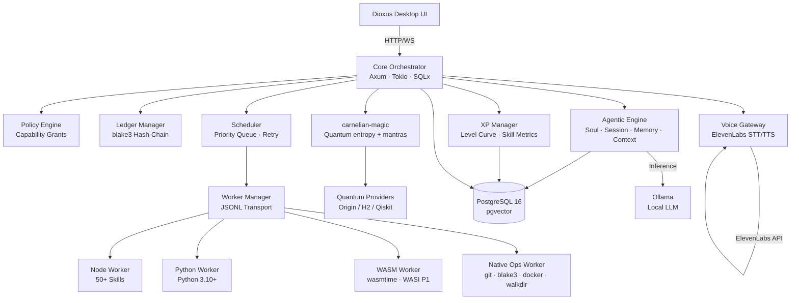
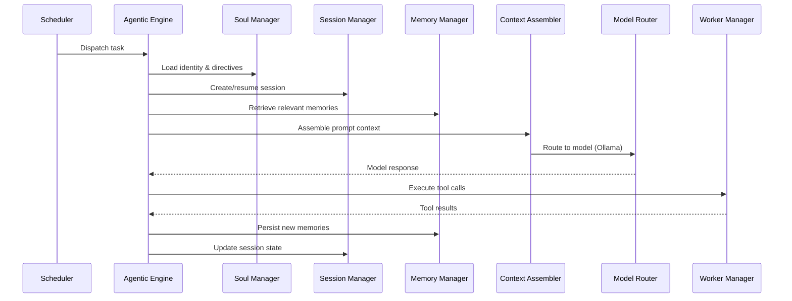

# 🔥 Carnelian OS — Architecture

## System Overview

Carnelian OS is a local-first AI agent mainframe built in Rust. It combines a capability-based security model with an event-stream architecture to provide reliable, auditable agentic execution. The core orchestrator (Axum/Tokio/SQLx) manages task scheduling, worker dispatch, policy enforcement, and a blake3 hash-chain ledger. Inference runs locally via Ollama, with an agentic execution pipeline (soul → session → memory → context → model routing → tool execution) driving autonomous behaviour. A Dioxus desktop UI provides real-time monitoring over WebSocket.

---

## Component Architecture

### Component Summary

| Component | Crate / Path | Technology | Responsibility |
|-----------|-------------|------------|----------------|
| **Core Orchestrator** | `carnelian-core/` (28 modules) | Axum, Tokio, SQLx | HTTP API, WebSocket events, request routing |
| **Scheduler** | `carnelian-core/src/scheduler.rs` | Rust | Priority queue, retry policies, concurrency limits |
| **Worker Manager** | `carnelian-core/src/worker.rs` | Rust | Process lifecycle, JSONL transport, capability dispatch |
| **Policy Engine** | `carnelian-core/src/policy.rs` | Rust | Deny-by-default capability checks, grant management |
| **Ledger Manager** | `carnelian-core/src/ledger.rs` | Rust, blake3 | Hash-chain audit trail for privileged actions |
| **Agentic Engine** | `carnelian-core/src/agentic/` | Rust | Soul, session, memory, context assembly, model routing |
| **XP Manager** | `carnelian-core/src/xp.rs` | Rust | XP awards, level curve, skill metrics, leaderboard |
| **Voice Gateway** | `carnelian-core/src/voice.rs` | Rust, reqwest | ElevenLabs STT/TTS, encrypted API key storage |
| **MAGIC** | `carnelian-magic/` | Rust, blake3, reqwest | Quantum entropy providers, mantra matrix, integrity hasher |
| **Event Stream** | `carnelian-core/src/events.rs` | Rust | Bounded-buffer pub/sub, priority sampling, backpressure |
| **Desktop UI** | `carnelian-ui/` (17 pages) | Dioxus | Native desktop interface with real-time event streaming |
| **Node Worker** | `workers/node-worker/` | Node.js/TypeScript | 50+ curated skills with bulk import tooling |
| **Python Worker** | `carnelian-worker-python/` + `workers/python-worker/` | Python 3.10+, JSONL | ML/data science skills, Playwright automation |
| **WASM Worker** | `carnelian-core/src/skills/wasm_runtime.rs` | wasmtime 27, WASI P1 | Sandboxed WASM skill execution with epoch timeout |
| **Native Ops Worker** | `carnelian-worker-native/src/lib.rs` | Rust inline (no subprocess) | `git_status`, `file_hash`, `docker_ps`, `dir_list` — capability-gated |

---

## Data Model

Tables are grouped by domain. See `db/migrations/` for full DDL.

### Identity & Soul

| Table | Purpose |
|-------|---------|
| `identities` | Agent identities (name, pronouns, type, soul file path, voice_config JSONB) |
| `soul_directives` | Parsed directives from SOUL.md files |

### Sessions & Messages

| Table | Purpose |
|-------|---------|
| `sessions` | Conversation sessions with lifecycle state |
| `messages` | Session messages (user, assistant, system, tool) |
| `memories` | Long-term memory with pgvector embeddings and importance scores |

### Tasks & Runs

| Table | Purpose |
|-------|---------|
| `tasks` | Task definitions with priority, status, skill binding |
| `task_runs` | Execution attempts with timing and result |
| `run_logs` | Paginated log output from task runs (LZ4 compressed) |

### Skills & XP

| Table | Purpose |
|-------|---------|
| `skills` | Skill registry (name, runtime, manifest checksum) |
| `skill_versions` | Version history for skill manifests |
| `xp_events` | Individual XP award records |
| `level_progression` | Agent level snapshots |
| `skill_metrics` | Per-skill usage, success rate, XP earned |

### Security & Ledger

| Table | Purpose |
|-------|---------|
| `capability_grants` | Active capability grants (subject, key, scope, constraints) |
| `approval_queue` | Pending approval requests for high-risk actions |
| `ledger_events` | Tamper-evident hash-chain of privileged actions |
| `config_store` | Encrypted configuration values (owner keypair, API keys) |

### Infrastructure

| Table | Purpose |
|-------|---------|
| `heartbeat_history` | Heartbeat cycle records with mantra and task counts |
| `model_providers` | Registered model providers (Ollama, remote) |
| `channels` | Communication channels |
| `sub_agents` | Sub-agent registrations |
| `workflows` | Workflow definitions |

---

## Event Stream Architecture

The event system (`crates/carnelian-core/src/events.rs`) implements a bounded-buffer pub/sub pattern:

1. **Producers** — Any component can publish events via `EventManager::publish()`.
2. **Bounded buffer** — Events are stored in a ring buffer with configurable capacity. When full, oldest events are dropped (backpressure).
3. **Priority sampling** — High-priority events (errors, level-ups, security alerts) are never dropped; low-priority events (heartbeat ticks, metric updates) are sampled under load.
4. **WebSocket delivery** — Clients connect to `/v1/events/ws` and receive a filtered stream. The server maintains per-client cursors to avoid duplicate delivery.
5. **Backpressure** — Slow consumers are disconnected after falling behind by more than the buffer capacity.

### Event Categories

| Priority | Examples | Behaviour Under Load |
|----------|----------|---------------------|
| **Critical** | `SecurityViolation`, `LedgerTamper` | Never dropped |
| **High** | `LevelUp`, `TaskFailed`, `ApprovalQueued` | Never dropped |
| **Normal** | `TaskCompleted`, `XpAwarded`, `SkillRefreshed` | Sampled at 50% |
| **Low** | `HeartbeatTick`, `MetricsSnapshot` | Sampled at 10% |

---

## Agentic Execution Pipeline

The agentic pipeline drives autonomous behaviour through heartbeat-driven task discovery and execution.

### Pipeline Stages

1. **Soul** — Load the agent's identity, directives, and personality from `identities` + `soul_directives`.
2. **Session** — Create or resume a conversation session; manage lifecycle (active → paused → completed).
3. **Memory** — Retrieve relevant long-term memories via pgvector similarity search; apply importance decay.
4. **Context** — Assemble the prompt: system message (soul + directives), memory context, session history, task description.
5. **Model Router** — Select provider (local Ollama or remote), send inference request, parse response.
6. **Tool Execution** — Extract tool calls from model response, dispatch to workers via the scheduler.
7. **Memory Persistence** — Store new observations and reflections back to long-term memory.
8. **Compaction** — Periodically compact session history to reduce context window usage.

---

## XP System

The `XpManager` (`crates/carnelian-core/src/xp.rs`) tracks agent progression:

- **XP Sources** — Ledger actions (10–50 XP), task completion (5–30 XP based on complexity), skill usage (5–15 XP), milestones (50–200 XP).
- **Level Curve** — `xp_required(level) = base_xp * level^1.172`. This sub-quadratic curve ensures steady progression without exponential grind.
- **Daily Quality Bonus** — A cron job awards bonus XP for high success rates (>90%) in the preceding 24 hours.
- **Skill Metrics** — Per-skill tracking of usage count, success rate, average execution time, and XP earned. Skills have independent levels.
- **Leaderboard** — All agents ranked by total XP, queryable via `GET /v1/xp/leaderboard`.

---

## Voice Gateway

The `VoiceGateway` (`crates/carnelian-core/src/voice.rs`) provides speech integration:

- **Inbound (STT)** — Audio input → ElevenLabs Speech-to-Text → text for agentic processing.
- **Outbound (TTS)** — Text response → ElevenLabs Text-to-Speech → audio output.
- **API Key Storage** — The ElevenLabs API key is encrypted in the `config_store` table using the project's `EncryptionHelper` (pgcrypto). It is never returned in API responses or stored in `machine.toml`.
- **Voice Configuration** — Per-identity `voice_config` JSONB on the `identities` table stores voice ID, model preference, and language settings.
- **Endpoints** — `POST /v1/voice/configure`, `POST /v1/voice/test`, `GET /v1/voice/voices`.

---

## MAGIC — Quantum Entropy & Mantra System

The `carnelian-magic` crate (`crates/carnelian-magic/`) provides quantum-enhanced entropy generation and mantra-based context injection for the agentic loop.

### Entropy Provider Chain

The `EntropyProvider` trait defines a waterfall chain for quantum-random byte generation:

1. **Quantum Origin** — REST API integration with `CARNELIAN_QUANTUM_ORIGIN_API_KEY` environment variable
2. **Quantinuum H2** — Hadamard circuit entropy via pytket; requires interactive auth (`carnelian magic auth`)
3. **Qiskit RNG** — IBM Quantum backend integration with `IBM_QUANTUM_TOKEN` environment variable
4. **OS CSPRNG** — `getrandom` crate fallback (always available)

Each provider is attempted in order. If a provider is unavailable or fails, the chain falls back to the next provider. The OS CSPRNG is always the final fallback, ensuring entropy is never unavailable.

### Quantum Hasher

`QuantumHasher` provides quantum-resistant checksums using BLAKE3 with MAGIC-mixed entropy salt:

- **`compute(data: &[u8]) -> String`** — Compute quantum checksum for a single data blob
- **`verify(data: &[u8], checksum: &str) -> bool`** — Verify data against stored checksum
- **`batch_compute(rows: Vec<&[u8]>) -> Vec<String>`** — Batch checksum computation for multiple rows

The entropy salt is mixed into the BLAKE3 hash to provide quantum-resistant integrity verification.

### Quantum Integrity Verifier

`QuantumIntegrityVerifier` provides table-level integrity verification:

- **`verify_table(table: &str) -> VerificationReport`** — Verify all rows in a table with quantum checksums
- **`verify_row(table: &str, id: Uuid) -> Result<bool>`** — Verify a single row's quantum checksum
- **`backfill_missing(table: &str) -> BackfillReport`** — Backfill missing quantum checksums in background

Returns `VerificationReport` with counts of verified, tampered, and missing checksums, plus a list of `TamperedRow` entries for any integrity violations.

### Mantra Tree

`MantraTree` provides weighted category selection seeded with quantum entropy:

- **Weighted Selection** — Categories have base weights that are dynamically adjusted based on context (pending tasks, recent errors, elixir quality scores)
- **Cooldown Map** — Per-category cooldown enforcement (`cooldown_beats` configuration) prevents repetitive context pollution
- **Inverse Frequency** — Within a chosen category, the least-recently-used mantra is selected
- **Quantum Seeding** — All random selection is seeded with quantum entropy from the provider chain

### Database Tables

| Table | Purpose |
|-------|---------|
| `magic_entropy_log` | Audit log of entropy requests (provider, byte count, timestamp) |
| `mantra_categories` | 18 mantra categories with base weights and cooldown settings |
| `mantra_entries` | 100+ mantra prompt fragments with usage tracking |
| `mantra_history` | Last 10 mantra selections with category, text, and timestamp |

### Setup

See [docs/MAGIC.md](MAGIC.md) for provider setup, authentication, troubleshooting, and security considerations.

---

## Configuration Precedence

Configuration is loaded in three layers (highest precedence wins):

1. **Environment variables** — `DATABASE_URL`, `CARNELIAN_HTTP_PORT`, `CARNELIAN_OWNER_KEYPAIR_PATH`, etc.
2. **Config file** — `machine.toml` (copy from `machine.toml.example`). Contains machine profile, worker settings, scan paths.
3. **Built-in defaults** — Hardcoded in `crates/carnelian-core/src/config.rs`.

See [.env.example](../.env.example) for environment variables and [machine.toml.example](../machine.toml.example) for file-based configuration.
