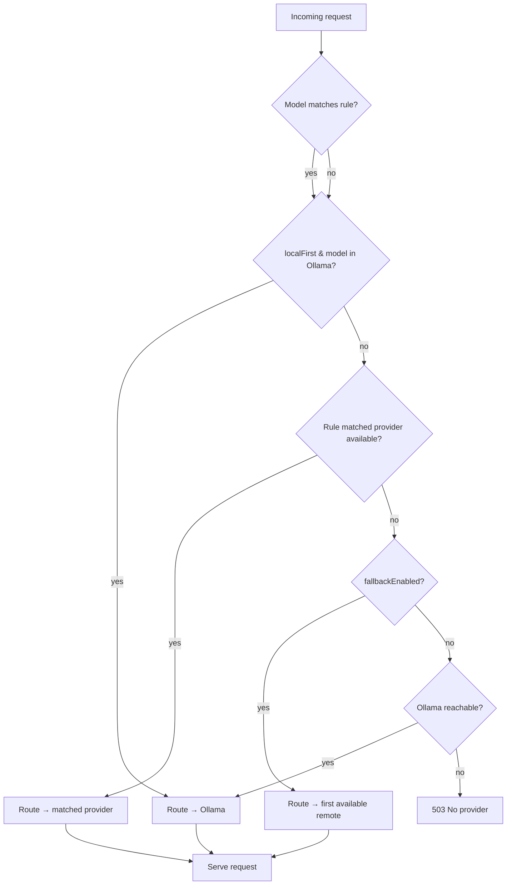

# LLM Gateway — Local-First Routing & Provider Management

**Carnelian Core v0.1.0**

The Gateway is a standalone TypeScript service (port 18790) that provides a single unified completion API over multiple LLM backends, separating all provider-facing network concerns from the Rust Core. It implements local-first routing, circuit breaker failover, SSE streaming, and usage tracking with automatic cost estimation.

---

## Table of Contents

1. [Overview](#overview)
2. [Provider Routing Algorithm](#provider-routing-algorithm)
3. [Circuit Breaker](#circuit-breaker)
4. [Streaming SSE](#streaming-sse)
5. [Provider Configuration](#provider-configuration)
6. [Usage Tracking](#usage-tracking)
7. [Voice Gateway Integration](#voice-gateway-integration)
8. [MAGIC Entropy Integration](#magic-entropy-integration)
9. [Local Development](#local-development)
10. [API Reference](#api-reference)

---

## Overview

The Gateway separates concerns between the Rust Core and LLM provider I/O:

- **Core** owns agents, tasks, memory, ledger
- **Gateway** owns all LLM provider I/O, routing, and cost tracking

### Architecture

```
Client
  │
  ▼
Gateway :18790
  │
  ├── Router ──── local-first check ──► OllamaProvider  (port 11434)
  │         └──── rule match ─────────► AnthropicProvider
  │                                  ► OpenAiProvider
  │                                  ► FireworksProvider
  │
  └── UsageTracker ──► POST {coreApiUrl}/api/usage
```

### Key Capabilities

✅ **Unified API** — Single `/v1/complete` endpoint for all providers  
✅ **Local-First** — Prefer Ollama for on-device inference when available  
✅ **Circuit Breaker** — Automatic failover when providers fail (3-strike threshold)  
✅ **Streaming SSE** — Server-Sent Events for real-time token streaming  
✅ **Usage Tracking** — Automatic cost estimation and batched reporting to Core  

---

## Provider Routing Algorithm

The `Router` (implemented in `gateway/src/router.ts`) executes a 6-step decision tree for each completion request:

### Routing Decision Tree



### Routing Steps

1. **Model-rule match** — `matchModelRule()` scans `MODEL_RULES` in order:
   - `claude` → `anthropic`
   - `gpt-`, `o1`, `o3` → `openai`
   - `accounts/fireworks` → `fireworks`
   - no match → `null`

2. **Local-first check** — If `routing.localFirst` is true and Ollama is healthy, check `isModelLocal()` (exact tag match or base-name prefix). If found → serve locally immediately.

3. **Rule-matched remote** — If a rule matched and that provider's circuit is closed → use it.

4. **Fallback sweep** — If `routing.fallbackEnabled`, iterate non-Ollama providers in insertion order and use the first with an open circuit.

5. **Last resort** — Try Ollama even if the model is not in the cached `ollamaModels` set.

6. **No provider** → Return `null` → 503 Service Unavailable.

---

## Circuit Breaker

The Gateway implements per-provider circuit breakers to prevent cascading failures.

### Circuit State Machine

| State | Condition | Behaviour |
|-------|-----------|-----------|
| **Closed** | failures < 3 | Requests pass through normally |
| **Open** | failures ≥ 3 | Requests skipped; router falls back |
| **Half-open** | open + 30 s elapsed | Next request allowed; success closes, failure re-opens |

### Implementation

Source: `packages/gateway/src/router.ts`

```typescript
interface CircuitState {
  failures: number;
  lastFailure: number;
  open: boolean;
}

const CIRCUIT_FAILURE_THRESHOLD = 3;
const CIRCUIT_RESET_MS = 30_000;
```

**Behavior:**
- `recordFailure()` increments failures; when `failures >= 3` sets `open = true`
- `recordSuccess()` deletes the state entirely (full reset)
- `isCircuitOpen()` checks if `Date.now() - lastFailure > 30_000`; if so, half-opens (resets `open` and `failures` to 0)

**Example:** When Anthropic's circuit is open, the router automatically falls back to the next available provider (OpenAI, Fireworks, or Ollama).

---

## Streaming SSE

The Gateway supports Server-Sent Events (SSE) for real-time token streaming.

### Endpoint

`POST /v1/complete/stream`

### Headers

```http
Content-Type: text/event-stream
Cache-Control: no-cache
Connection: keep-alive
X-Accel-Buffering: no
```

### Response Format

Each provider yields `AsyncIterable<CompletionChunk>`; the server forwards each chunk as:

```
data: {"delta":"Hello","finish_reason":null}

data: {"delta":" world","finish_reason":null}

data: {"delta":"!","finish_reason":"stop"}

data: [DONE]

```

### Error Handling

- **Client disconnect:** `req.on("close")` sets `closed = true` and breaks the async loop
- **Error mid-stream:**
  - If headers already sent: writes an error SSE event then `[DONE]`
  - If headers not sent: sends a normal 502 JSON body

### Token Estimation

Providers don't always include usage in chunks. The Gateway estimates tokens as `ceil(content.length / 4)`.

### Example

```bash
curl -X POST http://localhost:18790/v1/complete/stream \
  -H "Content-Type: application/json" \
  -d '{
    "model": "llama3.2",
    "messages": [{"role": "user", "content": "Hello!"}],
    "stream": true
  }'
```

**Response:**

```
data: {"delta":"Hello","finish_reason":null}

data: {"delta":"!","finish_reason":null}

data: {"delta":" How","finish_reason":null}

data: {"delta":" can","finish_reason":null}

data: {"delta":" I","finish_reason":null}

data: {"delta":" help","finish_reason":null}

data: {"delta":"?","finish_reason":"stop"}

data: [DONE]

```

---

## Provider Configuration

The Gateway uses a three-layer configuration priority:

**Priority:** Environment variables > `gateway.config.json` > Built-in defaults

### Environment Variables

| Variable | Default | Purpose |
|----------|---------|---------|
| `GATEWAY_PORT` | `18790` | HTTP listen port |
| `CORE_API_URL` | `http://localhost:8080` | Rust core base URL |
| `OLLAMA_BASE_URL` | `http://localhost:11434` | Ollama API base |
| `OLLAMA_ENABLED` | `true` | Enable Ollama provider |
| `OPENAI_API_KEY` | — | Enables OpenAI when set |
| `OPENAI_BASE_URL` | `https://api.openai.com` | OpenAI API base |
| `OPENAI_ENABLED` | `false` | Force-enable/disable OpenAI |
| `ANTHROPIC_API_KEY` | — | Enables Anthropic when set |
| `ANTHROPIC_BASE_URL` | `https://api.anthropic.com` | Anthropic API base |
| `ANTHROPIC_ENABLED` | `false` | Force-enable/disable Anthropic |
| `FIREWORKS_API_KEY` | — | Enables Fireworks when set |
| `FIREWORKS_BASE_URL` | `https://api.fireworks.ai/inference` | Fireworks API base |
| `FIREWORKS_ENABLED` | `false` | Force-enable/disable Fireworks |
| `LOCAL_FIRST` | `true` | Prefer local Ollama |
| `FALLBACK_ENABLED` | `true` | Fall back to remote providers |
| `MAX_TOKENS` | `8192` | Per-request generation cap |
| `REQUEST_TIMEOUT_MS` | `60000` | Per-request timeout |
| `CONTEXT_WINDOW` | `128000` | Input token limit |

### Configuration File

**`gateway.config.json`:**

```json
{
  "port": 18790,
  "coreApiUrl": "http://localhost:8080",
  "providers": {
    "ollama": {
      "enabled": true,
      "baseUrl": "http://localhost:11434"
    },
    "openai": {
      "enabled": false,
      "apiKey": "sk-...",
      "baseUrl": "https://api.openai.com"
    },
    "anthropic": {
      "enabled": false,
      "apiKey": "sk-ant-...",
      "baseUrl": "https://api.anthropic.com"
    },
    "fireworks": {
      "enabled": false,
      "apiKey": "fw-...",
      "baseUrl": "https://api.fireworks.ai/inference"
    }
  },
  "routing": {
    "localFirst": true,
    "fallbackEnabled": true
  },
  "limits": {
    "maxTokens": 8192,
    "requestTimeoutMs": 60000,
    "contextWindow": 128000
  }
}
```

---

## Usage Tracking

The `UsageTracker` (implemented in `packages/gateway/src/usage.ts`) maintains an in-memory buffer of completion usage and periodically flushes to the Core.

### Tracking Flow

1. **Track completion** — `trackCompletion()` calls `estimateCost()` (0 for Ollama; per-million pricing for remote models) then pushes a `UsageRecord`
2. **Buffer** — Records accumulate in `buffer: UsageRecord[]`
3. **Flush** — Every 10 seconds: POSTs `{ records: [...] }` to `{coreApiUrl}/api/usage` (compatibility endpoint) and `POST /v1/models/usage` (canonical endpoint)
4. **Retry** — On failure, re-queues records at buffer head
5. **Final flush** — `stop()` flushes before shutdown

### Pricing Table

| Model | Input ($/M tokens) | Output ($/M tokens) |
|-------|-------------------|---------------------|
| `gpt-4o` | $2.50 | $10.00 |
| `gpt-4o-mini` | $0.15 | $0.60 |
| `claude-3-5-sonnet-20241022` | $3.00 | $15.00 |
| `claude-3-5-haiku-20241022` | $0.80 | $4.00 |
| `claude-3-opus-20240229` | $15.00 | $75.00 |
| `accounts/fireworks/models/llama-v3p1-70b-instruct` | $0.90 | $0.90 |
| Ollama (all local) | $0.00 | $0.00 |

### UsageRecord Schema

```typescript
interface UsageRecord {
  timestamp: number;
  model: string;
  provider: string;
  inputTokens: number;
  outputTokens: number;
  totalTokens: number;
  estimatedCost: number;
  correlationId?: string;
}
```

**Destination:** Records are stored in the Core's `usage_costs` table for billing and analytics.

---

## Voice Gateway Integration

The Gateway provides voice capabilities via ElevenLabs integration.

### Speech-to-Text

**Endpoint:** `POST /v1/voice/transcribe`

**Request:**

```json
{
  "audio": "base64-encoded-wav-or-mp3",
  "language": "en"
}
```

**Response:**

```json
{
  "transcript": "Hello, how can I help you today?",
  "duration_ms": 2500,
  "language": "en"
}
```

### Text-to-Speech

**Endpoint:** `POST /v1/voice/synthesize`

**Request:**

```json
{
  "text": "Hello, how can I help you today?",
  "voice_id": "21m00Tcm4TlvDq8ikWAM",
  "voice_config": {
    "stability": 0.5,
    "similarity_boost": 0.75,
    "model_id": "eleven_monolingual_v1"
  }
}
```

**Response:**

```json
{
  "audio": "base64-encoded-mp3",
  "duration_ms": 2500,
  "voice_id": "21m00Tcm4TlvDq8ikWAM"
}
```

### Voice Configuration

The `voice_config` object is a session-level configuration (from the agent's soul file) that pins:
- `voice_id` — ElevenLabs voice identifier
- `stability` — Voice stability (0.0–1.0)
- `similarity_boost` — Voice similarity boost (0.0–1.0)
- `model_id` — ElevenLabs model identifier

Voice requests bypass the `Router` and go directly to the ElevenLabs API using the `ELEVENLABS_API_KEY` environment variable.

---

## MAGIC Entropy Integration

The Gateway integrates with the Core's MAGIC quantum entropy system for provenance tracking.

### Entropy Fetch

Before dispatching each completion request, the Gateway optionally fetches a quantum-seeded context bundle:

**Request:** `GET {coreApiUrl}/v1/magic/entropy`

**Response:**

```json
{
  "entropy_bytes": "a1b2c3d4e5f6...",
  "mantra_hint": "focus",
  "timestamp": "2026-03-04T10:30:00Z"
}
```

### Provenance Hash

The entropy bytes are used to compute a **provenance hash** (BLAKE3) that is attached to the `CompletionRequest`:

```typescript
interface CompletionRequest {
  model: string;
  messages: Message[];
  correlation_id?: string;
  provenance_hash?: string;  // BLAKE3(entropy_bytes)
}
```

### Audit Trail

The `provenance_hash` is logged alongside the `correlation_id`, allowing post-hoc auditing of which quantum entropy seed influenced a given LLM call.

**Behavior:**
- Entropy fetching is best-effort
- If the Core is unreachable or entropy is unavailable, the request proceeds without a provenance hash
- The `correlation_id` field bridges the gateway log and the Core's ledger event for the same request

---

## Local Development

### Setup

```bash
cd gateway
npm install          # installs zod + devDependencies
npm run build        # tsc → dist/
npm start            # node dist/index.js

# Or watch mode during development:
npm run dev          # tsc --watch (recompile on save; restart manually)
```

### Health Check

```bash
curl http://localhost:18790/health
```

**Response:**

```json
{
  "status": "ok",
  "version": "0.1.0",
  "uptime_s": 123,
  "providers": [
    {
      "name": "ollama",
      "type": "local",
      "available": true,
      "models": ["llama3.2", "mistral"]
    },
    {
      "name": "anthropic",
      "type": "remote",
      "available": true
    },
    {
      "name": "openai",
      "type": "remote",
      "available": false
    },
    {
      "name": "fireworks",
      "type": "remote",
      "available": false
    }
  ]
}
```

**Status values:**
- `"ok"` — All providers available
- `"degraded"` — Some providers available
- `"unavailable"` — No providers available

### Requirements

- **Node.js:** ≥ 22.0.0 (from `package.json` `engines` field)
- **Rust Core:** Not required for basic completion routing; usage records will buffer and retry when Core comes online

---

## API Reference

### Implemented Endpoints

The following endpoints are currently available:

| Endpoint | Method | Description |
|----------|--------|-------------|
| `/v1/complete` | POST | Non-streaming chat completion |
| `/v1/complete/stream` | POST | Streaming chat completion (SSE) |
| `/health` | GET | Provider health check |

### Planned Endpoints

The following endpoints are planned for future implementation:

| Endpoint | Method | Description | Status |
|----------|--------|-------------|--------|
| `/v1/providers` | GET | List configured providers and their status | Planned |
| `/v1/usage` | GET | Query buffered / recent usage records | Planned |
| `/v1/voice/transcribe` | POST | Speech-to-text via ElevenLabs | Planned |
| `/v1/voice/synthesize` | POST | Text-to-speech via ElevenLabs | Planned |

### POST /v1/complete

**Request:**

```json
{
  "model": "gpt-4o",
  "messages": [
    {"role": "system", "content": "You are a helpful assistant."},
    {"role": "user", "content": "Hello!"}
  ],
  "max_tokens": 1024,
  "temperature": 0.7,
  "correlation_id": "01936a1b-..."
}
```

**Response (200 OK):**

```json
{
  "content": "Hello! How can I assist you today?",
  "finish_reason": "stop",
  "usage": {
    "input_tokens": 15,
    "output_tokens": 9,
    "total_tokens": 24
  },
  "model": "gpt-4o",
  "provider": "openai"
}
```

**Errors:**
- `400 Bad Request` — Invalid request body
- `502 Bad Gateway` — Provider error
- `503 Service Unavailable` — No provider available

### POST /v1/complete/stream

**Request:** Same as `/v1/complete` with `"stream": true`

**Response (200 OK):** SSE stream (see [Streaming SSE](#streaming-sse))

### GET /health

**Response (200 OK):**

```json
{
  "status": "ok",
  "version": "0.1.0",
  "uptime_s": 123,
  "providers": [
    {
      "name": "ollama",
      "type": "local",
      "available": true,
      "models": ["llama3.2", "mistral"]
    },
    {
      "name": "anthropic",
      "type": "remote",
      "available": true
    }
  ]
}
```

**Status codes:**
- `200 OK` — At least one provider available
- `503 Service Unavailable` — No providers available


---

## See Also

- **[API.md](API.md)** — Carnelian Core REST API reference
- **[MAGIC.md](MAGIC.md)** — Quantum entropy system (provenance hashes)
- **[ELIXIR_SYSTEM.md](ELIXIR_SYSTEM.md)** — Knowledge context injected into completions
- **[ARCHITECTURE.md](ARCHITECTURE.md)** — Full system architecture

---

**Last Updated:** March 4, 2026  
**Version:** 0.1.0
