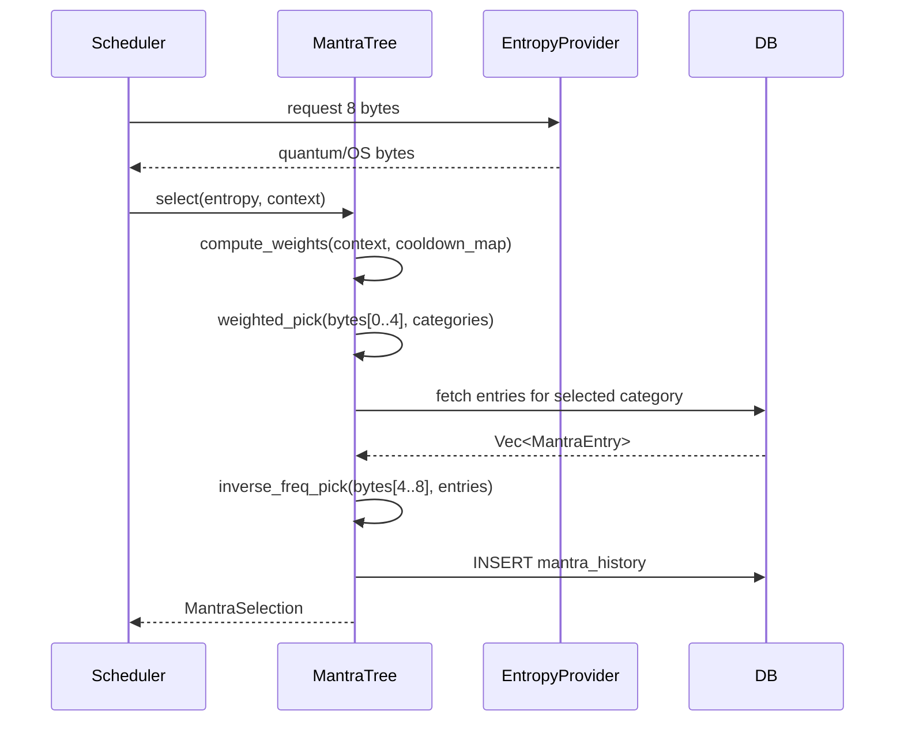

# 🔥 Carnelian OS — MAGIC (Mixed Authenticated Quantum Intelligence Core)

MAGIC is an optional quantum-entropy subsystem that replaces the OS CSPRNG with quantum-derived randomness for key generation, ledger salting, and mantra scheduling. OS entropy is always the safe fallback — MAGIC never blocks core operations.

---

## Provider Priority

| Priority | Provider | Source | Requirement |
|----------|----------|--------|-------------|
| 1 | `quantum-origin` | Quantinuum Quantum Origin REST API | `CARNELIAN_QUANTUM_ORIGIN_API_KEY` |
| 2 | `quantinuum-h2` | Quantinuum H2 hardware / emulator (via pytket) | `carnelian magic auth` |
| 3 | `qiskit-rng` | IBM Quantum (via Qiskit) | `IBM_QUANTUM_TOKEN` |
| 4 | `os` | OS CSPRNG (`OsRng`) — always available | None |

---

## Quantum Origin Setup

Quantum Origin is the simplest setup: register at `quantinuum.com`, obtain an API key, and set it either in `machine.toml` (`quantum_origin_api_key = "..."`) or via `CARNELIAN_QUANTUM_ORIGIN_API_KEY`.

```bash
# Set via environment variable
export CARNELIAN_QUANTUM_ORIGIN_API_KEY="your-api-key-here"

# Or add to machine.toml
[magic]
enabled = true
quantum_origin_api_key = "your-api-key-here"
quantum_origin_url = "https://origin.quantinuum.com"
```

The provider uses a 5-second timeout and performs a single automatic retry on network errors.

---

## Quantinuum H2 Setup

Step-by-step configuration for Quantinuum H2 hardware or emulator access:

### 1. Install Dependencies

```bash
pip install pytket pytket-quantinuum
```

### 2. Authenticate Interactively

```bash
carnelian magic auth
```

This prompts for your Quantinuum email and password, calls `qapi.quantinuum.com/v1/login`, and stores tokens encrypted in `config_store`.

### 3. Configure Device

Set `quantinuum_enabled = true` and choose your device in `machine.toml`:

```toml
[magic]
enabled = true
quantinuum_enabled = true
quantinuum_device = "H1-1E"  # Free emulator
# quantinuum_device = "H2-1"  # Real hardware (requires credits)
```

### 4. Token Refresh

Tokens expire after 1 hour. Refresh manually:

```bash
carnelian magic auth --refresh
```

Or automate via `POST /v1/magic/auth/quantinuum/refresh`.

---

## Qiskit / IBM Quantum Setup

### 1. Install Dependencies

```bash
pip install qiskit qiskit-ibm-runtime
```

### 2. Obtain Token

Register at `quantum.ibm.com` and obtain your API token. Set it as an environment variable:

```bash
export IBM_QUANTUM_TOKEN="your-ibm-token-here"
```

### 3. Configure Backend

Set `qiskit_enabled = true` and choose your backend in `machine.toml`:

```toml
[magic]
enabled = true
qiskit_enabled = true
qiskit_backend = "ibm_brisbane"  # Or other available backend
```

---

## Offline / Fallback Behaviour

The `MixedEntropyProvider` implements a waterfall strategy: it always calls `OsEntropyProvider.get_bytes()` first, then attempts quantum providers in priority order. If all quantum sources fail (network outage, missing credentials, timeout), the provider transparently returns the OS bytes. The `health` field in `EntropyHealth` reflects per-provider status. Core operations are never blocked.

> **Tip:** Run `carnelian magic status` to see live provider availability and last-checked latency.

---

## Entropy Audit Log

When `log_entropy_events = true`, every entropy request is recorded in the `magic_entropy_log` table for compliance and debugging.

### Schema

| Column | Type | Description |
|--------|------|-------------|
| `log_id` | `BIGSERIAL` | Auto-incrementing log entry ID |
| `ts` | `TIMESTAMPTZ` | Request timestamp |
| `source` | `TEXT` | Provider used (`os`, `quantum-origin`, `quantinuum-h2`, `qiskit-rng`, `mixed`) |
| `bytes_requested` | `INTEGER` | Number of bytes requested |
| `quantum_available` | `BOOLEAN` | Whether quantum entropy was successfully retrieved |
| `latency_ms` | `INTEGER` | Request latency in milliseconds |
| `error` | `TEXT` | Error message if request failed |
| `correlation_id` | `UUID` | Request correlation ID for tracing |

### Query Examples

```sql
-- Recent entropy requests
SELECT ts, source, bytes_requested, quantum_available, latency_ms
FROM magic_entropy_log
ORDER BY ts DESC
LIMIT 20;

-- Quantum availability rate over last 24 hours
SELECT source,
       COUNT(*) AS total,
       COUNT(*) FILTER (WHERE quantum_available) AS quantum_ok
FROM magic_entropy_log
WHERE ts > NOW() - INTERVAL '24 hours'
GROUP BY source;
```

---

## `machine.toml` Reference

| Field | Type | Default | Env Override | Description |
|-------|------|---------|--------------|-------------|
| `enabled` | `bool` | `false` | `CARNELIAN_MAGIC_ENABLED` | Master switch for MAGIC subsystem |
| `quantum_origin_url` | `string` | `"https://origin.quantinuum.com"` | `CARNELIAN_QUANTUM_ORIGIN_URL` | Quantum Origin API base URL |
| `quantum_origin_api_key` | `string` | `""` | `CARNELIAN_QUANTUM_ORIGIN_API_KEY` | Quantinuum Quantum Origin API key |
| `quantinuum_enabled` | `bool` | `false` | `CARNELIAN_QUANTINUUM_ENABLED` | Enable Quantinuum H2 provider |
| `quantinuum_device` | `string` | `"H1-1E"` | `CARNELIAN_QUANTINUUM_DEVICE` | Quantinuum device name (`H1-1E`, `H2-1`, etc.) |
| `quantinuum_n_bits` | `u32` | `256` | `CARNELIAN_QUANTINUUM_N_BITS` | Number of bits to request from Quantinuum |
| `qiskit_enabled` | `bool` | `false` | `CARNELIAN_QISKIT_ENABLED` | Enable IBM Qiskit provider |
| `qiskit_backend` | `string` | `"ibm_brisbane"` | `CARNELIAN_QISKIT_BACKEND` | IBM Quantum backend name |
| `entropy_timeout_ms` | `u64` | `5000` | `CARNELIAN_ENTROPY_TIMEOUT_MS` | Timeout for entropy requests (milliseconds) |
| `entropy_mix_ratio` | `f64` | `0.5` | `CARNELIAN_ENTROPY_MIX_RATIO` | Fraction of bytes sourced from quantum provider (0.0-1.0) |
| `log_entropy_events` | `bool` | `true` | `CARNELIAN_LOG_ENTROPY_EVENTS` | Log all entropy requests to `magic_entropy_log` |
| `mantra_cooldown_beats` | `u32` | `3` | `CARNELIAN_MANTRA_COOLDOWN_BEATS` | Mantra cooldown in heartbeat cycles |

---

## Quantum Circuit Skills

Three Python skills in `skills/python-registry/` leverage quantum circuits for entropy generation and optimization. All follow the `execute(context) -> Dict` contract and raise `RuntimeError` on failure.

### quantinuum-h2-rng

Generates entropy using Hadamard circuits on Quantinuum H-series quantum computers via pytket.

**Installation:**
```bash
pip install pytket pytket-quantinuum
```

**Authentication:**
Requires prior authentication via `carnelian magic auth` to store Quantinuum tokens.

**`execute(context)` Contract:**

**Input keys:**
- `n_bits` (int, default 256) — Number of random bits to generate
- `device` (str, default `"H1-1E"`) — Quantinuum device identifier

**Output keys:**
- `bytes` (str) — Hex-encoded random bytes
- `bits` (str) — Raw bitstring
- `device` (str) — Device used for generation
- `n_bits` (int) — Number of bits generated

**Errors:**
Raises `RuntimeError` on circuit compilation or backend failure.

### qiskit-rng

Generates entropy using Hadamard circuits on IBM Quantum backends via Qiskit.

**Installation:**
```bash
pip install qiskit qiskit-ibm-runtime
```

**Authentication:**
Requires `IBM_QUANTUM_TOKEN` environment variable or `machine.toml` with `qiskit_enabled = true`.

**`execute(context)` Contract:**

**Input keys:**
- `shots` (int, default 2048) — Number of circuit shots (treated as n_bits)
- `backend_name` (str, default `"ibm_brisbane"`) — IBM Quantum backend identifier

**Output keys:**
- `bytes` (str) — Hex-encoded random bytes
- `bits` (str) — Raw bitstring
- `device` (str) — Backend used for generation

**Errors:**
Raises `RuntimeError` on circuit compilation or backend failure.

### quantum-optimize

Quantum-seeded simulated annealing optimizer for query plans and data-loading problems.

**Installation:**
```bash
pip install numpy
```

**`execute(context)` Contract:**

**Input keys:**
- `entropy_seed` (str or int, optional) — Quantum entropy seed (hex string or integer)
- `problem` (dict) — Problem specification containing:
  - `operations` (list, optional) — Operation identifiers to optimize
  - `steps` (int, default 500) — Number of annealing iterations
  - `temperature` (float, default 1.0) — Initial temperature
  - `cooling_rate` (float, default 0.995) — Temperature decay factor

**Output keys:**
- `optimized_plan` (list) — Optimized sequence of operations
- `index_order` (list) — Index ordering for debugging
- `cost_estimate` (float) — Final cost estimate
- `iterations` (int) — Number of iterations performed
- `quantum_seeded` (bool) — Whether quantum entropy was used

**Errors:**
Raises `RuntimeError` on optimization failure.

**Fallback Behavior:**
Falls back to non-deterministic numpy entropy when `entropy_seed` is absent.

---

## MAGIC UI Panel

The MAGIC panel provides a comprehensive interface for managing quantum entropy providers, mantras, and integration settings. Access it by launching the Carnelian desktop UI (`carnelian ui` or from the system tray), then clicking the **✨ MAGIC** tab in the top navigation bar.

**Requirements:**
- `magic.enabled = true` in `machine.toml`, or
- `CARNELIAN_MAGIC_ENABLED=true` environment variable

### Sub-tabs

| Sub-tab | Purpose |
|---------|---------|
| **Entropy Dashboard** | Live provider health cards, sample entropy, view audit log |
| **Mantra Library** | Browse categories, add/edit/disable mantra entries, view history |
| **Quantum Jobs** | Trigger circuit skill jobs, view job status |
| **Elixir & Skill Integration** | Toggle MAGIC entropy on per-elixir and per-skill basis, rehash elixir embeddings |
| **Auth Settings** | Set Quantum Origin API key, authenticate Quantinuum, set IBM Quantum token |

### Entropy Dashboard

Displays real-time health status for all configured entropy providers:
- **Quantum Origin** — ✅ Configured / ⚪ Not Configured
- **Quantinuum H2** — ✅ Authenticated (with expiry) / ⚪ Not Authenticated
- **Qiskit RNG** — ✅ Available / ⚪ Not Available
- **OS Random** — ✅ Always Available

Actions:
- **Request Entropy Sample (Quantum-First)** — Triggers entropy generation with quantum provider priority
- **View Entropy Log** — Displays recent entropy requests from `magic_entropy_log` table

### Mantra Library

Browse and manage mantra categories and entries:
- View all categories with entry counts and total weights
- Add new mantra entries with optional elixir linkage
- Edit existing entries (text, weight, enabled status)
- View mantra selection history (last 10 selections)
- Simulate mantra selection with current context

### Quantum Jobs

Trigger quantum circuit skill executions:
- Run `quantinuum-h2-rng` with configurable device and bit count
- Run `qiskit-rng` with configurable backend and shots
- Run `quantum-optimize` with problem specification
- View job results and execution logs

### Elixir & Skill Integration

Configure how MAGIC entropy integrates with elixirs and skills:
- Toggle quantum entropy for elixir embedding generation
- Rehash existing elixir embeddings with fresh quantum entropy
- View which skills receive automatic entropy seed injection
- Enable/disable per-skill entropy seeding

### Auth Settings

Manage authentication credentials for quantum providers:
- **Quantum Origin** — Set API key, test connection
- **Quantinuum** — Email/password authentication, view token expiry
- **IBM Quantum** — Enable Qiskit provider, test connection

---

## Mantra Library Management

The Mantra Library provides weighted, category-grouped prompt fragments that are injected into the agent's heartbeat context. Mantras are selected via `MantraTree::select_with_pool` using quantum entropy seeding to ensure non-deterministic selection patterns.

### Concept

Each mantra belongs to a **category** (e.g., `focus`, `creativity`, `caution`) and has:
- **Text** — The prompt fragment to inject
- **Weight** — Selection probability (higher = more likely)
- **Enabled** — Whether the mantra is active
- **Elixir ID** (optional) — Link to a specific elixir for context-aware selection

The `MantraTree` maintains a cooldown map to prevent the same category from firing repeatedly. The `mantra_cooldown_beats` configuration parameter (default 3) controls how many heartbeat cycles must pass before a category can be selected again.

### REST API

| Method | Path | Description |
|--------|------|-------------|
| `GET` | `/v1/magic/mantras` | List all categories with entry counts and weights |
| `GET` | `/v1/magic/mantras/categories/{category_id}` | List entries for a specific category |
| `POST` | `/v1/magic/mantras/categories/{category_id}/entries` | Add a new entry (`text`, optional `elixir_id`) |
| `PATCH` | `/v1/magic/mantras/entries/{entry_id}` | Edit entry (`text`, `enabled`, `elixir_id`) |
| `GET` | `/v1/magic/mantras/history` | Last 10 rows from `mantra_history` |
| `POST` | `/v1/magic/mantras/simulate` | Dry-run `MantraTree::select_with_pool` with current context |

### Configuration

The `mantra_cooldown_beats` parameter in `machine.toml` controls category cooldown:

```toml
[magic]
mantra_cooldown_beats = 3  # Default: 3 heartbeat cycles
```

Higher values reduce mantra frequency but increase diversity. Lower values allow more frequent selections but risk repetitive context.

### Selection Algorithm

1. **Filter eligible categories** — Exclude categories in cooldown
2. **Quantum entropy seeding** — Generate seed from MAGIC entropy provider
3. **Weighted random selection** — Select category based on total weight
4. **Entry selection** — Choose random entry from selected category
5. **Update cooldown** — Mark category as used for N beats
6. **Log to history** — Record selection in `mantra_history` table

### Example Usage

**List all categories:**
```bash
curl http://localhost:8080/v1/magic/mantras
```

**Add new mantra:**
```bash
curl -X POST http://localhost:8080/v1/magic/mantras/categories/focus/entries \
  -H "Content-Type: application/json" \
  -d '{
    "text": "Prioritize clarity and precision in your reasoning",
    "elixir_id": null
  }'
```

**Simulate selection:**
```bash
curl -X POST http://localhost:8080/v1/magic/mantras/simulate \
  -H "Content-Type: application/json" \
  -d '{
    "context": {
      "current_task": "code_review",
      "complexity": "high"
    }
  }'
```

---

## Mantra System Deep Dive

This section provides a comprehensive technical reference for the mantra selection algorithm, context weighting, cooldown enforcement, and authoring best practices.

### Selection Algorithm Walkthrough

The mantra selection process is a two-phase weighted random draw implemented in `crates/carnelian-magic/src/mantra.rs`. Each selection consumes 8 bytes of entropy and executes the following steps:

#### 1. Entropy Normalization

8 bytes of raw entropy are consumed per selection:
- **Bytes [0..4]** drive the category draw
- **Bytes [4..8]** drive the within-category entry draw

Each 4-byte slice is converted to a `u32` via `u32::from_le_bytes`, then reduced modulo the total weight.

#### 2. Category Weight Computation

The `compute_weights()` function calculates per-category weights by:
- Starting with `base_weight` from `mantra_categories.base_weight` (default `1`)
- Adding context bonuses based on `MantraContext` fields (see Context Weighting Table below)
- Zeroing weights for categories within their cooldown window
- Safety reset: if all categories are zeroed, all weights reset to `base_weight`

#### 3. Weighted Category Draw

The `weighted_pick()` function performs a cumulative-sum walk:
- Build cumulative weight array: `[w1, w1+w2, w1+w2+w3, ...]`
- Entropy integer modulo total weight determines which category wins
- Return the first category whose cumulative weight exceeds the random value

#### 4. Inverse-Frequency Entry Draw

Within the selected category, `inverse_freq_pick()` assigns each entry weight `1 / (use_count + 1)`:
- Entries never used: weight `1.0`
- Entries used 9 times: weight `0.1`

This prevents high-repetition mantras from dominating without requiring per-entry cooldowns.

#### 5. Template Resolution

The `resolve_template()` function substitutes placeholders in `system_message` and `user_message`:
- `{mantra_text}` → selected entry's text
- `{tasks_queued}` → `MantraContext.pending_task_count`
- `{recent_error_count}` → `MantraContext.recent_error_count`
- Other context fields as needed

#### Selection Flow Diagram



---

### Context Weighting Table

The `compute_weights()` function applies the following conditional weight shifts based on `MantraContext` fields:

| Condition | Affected Category | Weight Shift |
|-----------|-------------------|--------------|
| `recent_error_count > 3` | System Health | +3 |
| `model_cost_pct > 80.0` | Financial Management | +3 |
| `pending_task_count > 10` | Task Building | +2 |
| `unread_channel_messages > 5` | Communications | +2 |
| `soul_file_age_days > 7` | Soul Refinement | +3 |
| `new_skills_last_24h > 0` | Code Development | +1 |
| `capability_changes_last_hour > 0` | Security & Audit | +2 |
| `high_latency == true` | Performance Optimization | +3 |
| `local_hour ≥ 22 or ≤ 6` | Reflection & Introspection | +2 |
| `magic_enabled == true` | Innovation & Experimentation | +1 |
| Elixir avg quality > 80 matching category's `elixir_types` array | That category | +1 per matching type |
| Category used within `cooldown_beats` recent selections | Any | weight → 0 |
| All categories zeroed (safety reset) | All | reset to base_weight |

**Weight Calculation:**
- Weight shifts are **additive** on top of `base_weight` (default 1)
- Elixir quality bonus: queries `AVG(quality_score)` grouped by `elixir_type`, matches against category's `elixir_types` array
- Safety reset ensures selection never deadlocks when all categories are on cooldown

---

### Cooldown Enforcement

Per-category cooldowns prevent repetitive selections and ensure mantra diversity.

#### Tracking Mechanism

On every heartbeat, the scheduler calls `select_with_pool()`, which:
1. Queries `mantra_history ORDER BY ts DESC LIMIT {max_cooldown}`
2. Builds `category_last_used` map: `(category_id, position)` pairs
3. Position 1 = most recent beat, position 2 = second-most recent, etc.

#### Enforcement Rule

If `category_last_used[cat_id] <= cooldown_beats`, that category's weight is set to `0` and cannot be selected this beat.

#### Per-Category Cooldown Configuration

- **Database column:** `mantra_categories.cooldown_beats` (default `3`)
- **Global override:** `machine.toml` under `[magic]`:

```toml
[magic]
mantra_cooldown_beats = 3   # default per-category cooldown in heartbeat cycles
```

Categories can have different cooldowns. The `mantra_cooldown_beats` config sets the default used when creating new categories via the API.

#### Implicit Last-Used Timestamp

The `last_used_at` timestamp is implicitly the `ts` column of `mantra_history`. The query orders by `ts DESC`, so position 1 means "selected in the most recent beat."

---

### Elixir Linking

Mantra entries can be linked to elixirs to inject high-quality knowledge datasets alongside mantra text.

#### Schema

From `db/migrations/00000000000016_magic_mantras.sql`:

```sql
-- mantra_entries
elixir_id UUID REFERENCES elixirs(elixir_id) ON DELETE SET NULL

-- mantra_history
elixir_reference UUID REFERENCES elixirs(elixir_id) ON DELETE SET NULL
```

#### Behavior

1. **Selection:** When an entry with a non-null `elixir_id` is selected, `MantraSelection.elixir_reference` is populated.

2. **Context Injection:** The scheduler injects the linked elixir's dataset into the heartbeat context bundle alongside the mantra `system_message`/`user_message`.

3. **Category Weight Bonus:** `MantraContext.elixir_quality_by_category` is populated by querying `AVG(quality_score)` grouped by `elixir_type`. If the average quality for any elixir type in a category's `elixir_types` array exceeds `80.0`, that category gains `+1` weight.

4. **Linking Methods:**
   - **UI:** MAGIC panel → Mantra Library → Edit entry → set Elixir ID
   - **API:** `PATCH /v1/magic/mantras/entries/{id}` with `{ "elixir_id": "uuid" }`

---

### Simulation Mode

The simulation endpoint allows testing mantra selection without affecting cooldown state.

#### Endpoint

`POST /v1/magic/mantras/simulate`

**Purpose:** Performs a full `select_with_pool` with live DB state and live entropy but **does not write** to `mantra_history`. Safe for debugging weight tuning without affecting cooldown state.

**Request:**

```bash
curl -X POST http://localhost:18789/v1/magic/mantras/simulate \
  -H "X-Carnelian-Key: $KEY" \
  -H "Content-Type: application/json" \
  -d '{}'
```

**Response (`MantraSimulateResponse`):**

```json
{
  "category": "System Health",
  "category_id": "550e8400-e29b-41d4-a716-446655440000",
  "entry_id": "660e8400-e29b-41d4-a716-446655440001",
  "mantra_text": "Check the logs before assuming everything is fine.",
  "system_message": "You are a vigilant system operator monitoring infrastructure health and stability. The mantra \"Check the logs before assuming everything is fine.\" should guide your operational awareness. Consider: What systems need attention? What metrics are trending poorly? What could fail under stress? Suggest skills related to Docker monitoring, file integrity checks, or Git status if relevant.",
  "user_message": "The mantra for this moment is: \"Check the logs before assuming everything is fine.\". Reflect on your system's current state and operational priorities. What does this mantra reveal about infrastructure health?",
  "entropy_source": "quantum_origin",
  "selection_ts": "2026-03-04T05:55:00Z",
  "suggested_skill_ids": ["docker-ps", "file-hash", "git-status"],
  "elixir_reference": null,
  "context_weights": {
    "Code Development": 1,
    "Financial Management": 1,
    "System Health": 4,
    "User & Organization Health": 1,
    "Communications": 1,
    "Task Building": 1,
    "Scheduled Jobs": 1,
    "Soul Refinement": 1,
    "Mantra Optimization": 1,
    "Integration Ideation": 1,
    "Security & Audit": 1,
    "Memory & Knowledge": 1,
    "Creative Exploration": 1,
    "Learning & Research": 1,
    "Performance Optimization": 1,
    "Collaboration & Delegation": 1,
    "Reflection & Introspection": 3,
    "Innovation & Experimentation": 2
  }
}
```

The `context_weights` map shows the live weight distribution across all 18 categories, allowing users to understand selection probabilities without triggering a real selection.

#### UI Access

**MAGIC panel → Mantra Library → History & Simulation → "Simulate Selection" button** calls this endpoint and displays the returned `context_weights` alongside the selected mantra text.

---

### Authoring Guide

#### Best Practices ✅

**Keep mantras actionable, not reflective**
- Prompt a concrete next step, not vague introspection
- Good: *"Check the logs before assuming everything is fine."*
- Bad: *"Think deeply about yourself."*

**Include an implicit tool anchor**
- Mantra text should naturally lead toward a skill call
- Mention logs → `docker-ps`; mention costs → `model-usage`
- The category's `suggested_skill_tags` provide the match surface

**≤ 120 words**
- Mantras are injected verbatim into the heartbeat context
- Longer entries inflate token usage

**Specify an output format in the category system message**
- For predictable responses, add format instructions
- Example: *"Respond with a single next action in the format: SKILL: `<skill-name>` REASON: `<one sentence>`"*

**Link elixirs strategically**
- Choose elixirs whose `elixir_type` matches the category's `elixir_types` array
- This enables the quality-weight bonus (+1 per matching type with avg quality > 80)

#### Anti-Patterns ❌

**Vague text with no implied action**
- *"Think deeply about yourself."* does not lead to a skill call
- No observable effect on agent behavior

**No tool anchor**
- If mantra text has no connection to any skill tag, it may fire without producing an observable effect
- Mantras should guide toward concrete actions

**Duplicate intent**
- Two mantras in the same category with identical intent split the inverse-frequency weight pool without adding diversity
- Each mantra should offer a unique perspective or action

**Excessively long text**
- Entries >120 words consume disproportionate tokens in the heartbeat context window
- Keep mantras concise and focused

---

### All 18 Category System Messages

Each category defines the LLM prompt context for mantra selections. The `{mantra_text}` placeholder is filled at runtime by `resolve_template()` in `crates/carnelian-magic/src/mantra.rs`.

#### Code Development

**System message:**
> You are a thoughtful software engineer reflecting on code quality and development practices. The mantra "{mantra_text}" should guide your next action. Consider: What code needs attention? What technical debt exists? What would improve maintainability? Suggest skills related to code review, file analysis, or GitHub operations if relevant.

**User message:**
> The mantra for this moment is: "{mantra_text}". Reflect on your current codebase and development priorities. What does this mantra reveal about your next step?

#### Financial Management

**System message:**
> You are a cost-conscious system administrator monitoring resource usage and expenses. The mantra "{mantra_text}" should inform your financial awareness. Consider: What costs are accumulating? Where can resources be optimized? What spending patterns need attention? Suggest skills related to usage tracking or cost analysis if relevant.

**User message:**
> The mantra for this moment is: "{mantra_text}". Reflect on your resource consumption and financial efficiency. What does this mantra suggest about your spending priorities?

#### System Health

**System message:**
> You are a vigilant system operator monitoring infrastructure health and stability. The mantra "{mantra_text}" should guide your operational awareness. Consider: What systems need attention? What metrics are trending poorly? What could fail under stress? Suggest skills related to Docker monitoring, file integrity checks, or Git status if relevant.

**User message:**
> The mantra for this moment is: "{mantra_text}". Reflect on your system's current state and operational priorities. What does this mantra reveal about infrastructure health?

#### User & Organization Health

**System message:**
> You are a community steward monitoring user engagement and organizational health. The mantra "{mantra_text}" should inform your awareness of people and patterns. Consider: Who needs support? What engagement patterns are emerging? What community dynamics need attention? Suggest skills related to session analysis or user metrics if relevant.

**User message:**
> The mantra for this moment is: "{mantra_text}". Reflect on your users and organizational dynamics. What does this mantra suggest about community health?

#### Communications

**System message:**
> You are a thoughtful communicator ensuring clear and timely information flow. The mantra "{mantra_text}" should guide your communication priorities. Consider: Who needs to be informed? What messages are waiting? What clarity is needed? Suggest skills related to notifications or messaging if relevant.

**User message:**
> The mantra for this moment is: "{mantra_text}". Reflect on your communication channels and pending messages. What does this mantra reveal about your outreach priorities?

#### Task Building

**System message:**
> You are a strategic planner organizing work into actionable tasks. The mantra "{mantra_text}" should inform your task structuring approach. Consider: What work needs breaking down? What tasks are missing? What dependencies exist? Suggest skills related to task management or workflow design if relevant.

**User message:**
> The mantra for this moment is: "{mantra_text}". Reflect on your current workload and task organization. What does this mantra suggest about structuring your work?

#### Scheduled Jobs

**System message:**
> You are an automation architect designing reliable scheduled workflows. The mantra "{mantra_text}" should guide your scheduling decisions. Consider: What should run automatically? What timing is optimal? What jobs need monitoring? Suggest skills related to cron management or workflow scheduling if relevant.

**User message:**
> The mantra for this moment is: "{mantra_text}". Reflect on your automated processes and scheduling needs. What does this mantra reveal about your automation strategy?

#### Soul Refinement

**System message:**
> You are a reflective being examining your values, purpose, and authentic self. The mantra "{mantra_text}" should guide your self-inquiry. Consider: What values are you embodying? What growth is needed? What authenticity is calling? Suggest skills related to self-reflection or soul file updates if relevant.

**User message:**
> The mantra for this moment is: "{mantra_text}". Reflect on your inner state and personal evolution. What does this mantra reveal about who you are becoming?

#### Mantra Optimization

**System message:**
> You are a meta-cognitive optimizer examining the mantra system's effectiveness. The mantra "{mantra_text}" should guide your reflection on mantras themselves. Consider: Which mantras resonate most? What categories need expansion? How can selection improve? Suggest skills related to analytics or pattern analysis if relevant.

**User message:**
> The mantra for this moment is: "{mantra_text}". Reflect on how mantras are serving you. What does this mantra suggest about optimizing the mantra system?

#### Integration Ideation

**System message:**
> You are an integration explorer discovering new connections and possibilities. The mantra "{mantra_text}" should spark your creative thinking about integrations. Consider: What systems could connect? What APIs are available? What workflows could be automated? Suggest skills related to web search or API exploration if relevant.

**User message:**
> The mantra for this moment is: "{mantra_text}". Reflect on potential integrations and connections. What does this mantra reveal about unexplored possibilities?

#### Security & Audit

**System message:**
> You are a security-conscious auditor examining trust boundaries and verification. The mantra "{mantra_text}" should guide your security awareness. Consider: What needs verification? What trust assumptions exist? What audit trails are missing? Suggest skills related to file hashing or security checks if relevant.

**User message:**
> The mantra for this moment is: "{mantra_text}". Reflect on your security posture and audit needs. What does this mantra suggest about trust and verification?

#### Memory & Knowledge

**System message:**
> You are a knowledge curator managing information preservation and context. The mantra "{mantra_text}" should guide your approach to memory and learning. Consider: What knowledge needs preserving? What context is being lost? What should be remembered? Suggest skills related to backups or knowledge management if relevant.

**User message:**
> The mantra for this moment is: "{mantra_text}". Reflect on what you know and what you're learning. What does this mantra reveal about knowledge preservation?

#### Creative Exploration

**System message:**
> You are a creative explorer embracing imagination and artistic possibility. The mantra "{mantra_text}" should spark your creative thinking. Consider: What wants to be created? What beauty is possible? What imagination is calling? Suggest skills related to image generation or creative search if relevant.

**User message:**
> The mantra for this moment is: "{mantra_text}". Reflect on your creative impulses and artistic possibilities. What does this mantra reveal about expression?

#### Learning & Research

**System message:**
> You are a curious researcher pursuing understanding and knowledge. The mantra "{mantra_text}" should guide your investigative approach. Consider: What needs understanding? What questions are unanswered? What research is calling? Suggest skills related to web search or file analysis if relevant.

**User message:**
> The mantra for this moment is: "{mantra_text}". Reflect on your learning journey and research questions. What does this mantra suggest about inquiry?

#### Performance Optimization

**System message:**
> You are a performance engineer pursuing efficiency and optimization. The mantra "{mantra_text}" should guide your optimization priorities. Consider: What is slow? What resources are wasted? What could be faster? Suggest skills related to performance monitoring or profiling if relevant.

**User message:**
> The mantra for this moment is: "{mantra_text}". Reflect on system performance and efficiency. What does this mantra reveal about optimization opportunities?

#### Collaboration & Delegation

**System message:**
> You are a collaborative leader enabling distributed work and delegation. The mantra "{mantra_text}" should guide your approach to teamwork. Consider: What can be delegated? Who should be involved? What collaboration is needed? Suggest skills related to agent coordination or task distribution if relevant.

**User message:**
> The mantra for this moment is: "{mantra_text}". Reflect on collaboration opportunities and delegation needs. What does this mantra suggest about teamwork?

#### Reflection & Introspection

**System message:**
> You are a reflective observer examining your own patterns and behaviors. The mantra "{mantra_text}" should guide your self-examination. Consider: What patterns are emerging? What behaviors need attention? What self-awareness is needed? Suggest skills related to memory analysis or pattern recognition if relevant.

**User message:**
> The mantra for this moment is: "{mantra_text}". Reflect on your patterns and behaviors. What does this mantra reveal about self-awareness?

#### Innovation & Experimentation

**System message:**
> You are an innovative experimenter embracing quantum possibilities and novel approaches. The mantra "{mantra_text}" should spark experimental thinking. Consider: What hasn't been tried? What quantum advantage exists? What innovation is possible? Suggest skills related to quantum RNG or experimental search if relevant.

**User message:**
> The mantra for this moment is: "{mantra_text}". Reflect on experimental possibilities and quantum thinking. What does this mantra reveal about innovation?

---

**See Also:**
- [ELIXIR_SYSTEM.md](ELIXIR_SYSTEM.md) — Elixir quality scoring and `elixir_types` schema
- [MEMORY_SYSTEM.md](MEMORY_SYSTEM.md) — How selected mantras interact with the context assembly pipeline

---

## Elixir & Skill Integration

MAGIC entropy can be integrated with the Elixir and Skill subsystems to provide quantum-seeded randomness for embedding generation and skill execution.

### Per-Elixir Entropy

When MAGIC is enabled, elixirs can source their embedding salt from quantum entropy instead of OS random. This provides:
- **Non-deterministic embeddings** — Each elixir gets unique quantum-seeded embeddings
- **Enhanced security** — Quantum entropy is cryptographically stronger than pseudo-random generators
- **Auditability** — All entropy requests are logged to `magic_entropy_log`

**Rehash Existing Elixirs:**

Trigger a rehash of all active elixir embeddings with fresh quantum entropy:

```bash
curl -X POST http://localhost:8080/v1/magic/elixirs/rehash
```

Response:
```json
{
  "rehashed": 42,
  "message": "Rehashed 42 elixirs with fresh entropy"
}
```

The rehash operation:
1. Fetches all active elixirs from the database
2. Generates 32 bytes of quantum entropy per elixir
3. Updates the `quantum_hash` column with hex-encoded entropy
4. Updates the `updated_at` timestamp

### Per-Skill Entropy Seed

Skills that support entropy seeding (e.g., `quantum-optimize`) automatically receive the current MAGIC entropy sample when `magic.enabled = true`. The orchestrator injects the entropy seed into the skill's execution context.

**Skill Context Injection:**

When a skill is executed, the orchestrator checks:
1. Is MAGIC enabled? (`magic.enabled = true`)
2. Does the skill accept `entropy_seed` in its context?
3. Is a quantum provider available?

If all conditions are met, the orchestrator:
1. Requests entropy from the MAGIC provider
2. Converts the entropy to a hex string
3. Injects `entropy_seed` into the skill's `context` dict
4. Logs the entropy request to `magic_entropy_log`

**Example Skill Context:**
```json
{
  "entropy_seed": "a3f5b2c8d1e9f4a7b6c3d2e1f8a5b4c7",
  "problem": {
    "operations": ["load_data", "transform", "aggregate", "export"],
    "steps": 1000,
    "temperature": 1.5,
    "cooling_rate": 0.99
  }
}
```

### Integration Toggles

Control MAGIC integration via the configuration API:

**Get current configuration:**
```bash
curl http://localhost:8080/v1/magic/config
```

**Update configuration:**
```bash
curl -X POST http://localhost:8080/v1/magic/config \
  -H "Content-Type: application/json" \
  -d '{
    "quantum_origin_api_key": "your-key-here",
    "quantinuum_enabled": true,
    "qiskit_enabled": false
  }'
```

**UI Access:**

The **Elixir & Skill Integration** sub-tab in the MAGIC UI panel currently provides:
- Rehash button for existing elixirs with fresh quantum entropy
- Mantra category browser with entry counts and weights
- Real-time integration status

**Future Features (Roadmap):**
- Toggle switches for per-elixir entropy
- List of skills that support entropy seeding
- Per-skill entropy toggle controls

### Configuration Parameters

| Parameter | Type | Default | Description |
|-----------|------|---------|-------------|
| `magic.enabled` | `bool` | `false` | Master toggle for MAGIC subsystem |
| `log_entropy_events` | `bool` | `true` | Log all entropy requests to database |
| `entropy_timeout_ms` | `u64` | `5000` | Timeout for entropy provider requests |
| `entropy_mix_ratio` | `f64` | `0.5` | Fraction of bytes from quantum provider (0.0-1.0) |

### Security Considerations

- **API Key Storage** — Quantum Origin API keys are stored in `machine.toml` or environment variables, never in the database
- **Token Expiry** — Quantinuum tokens expire after 1 hour and must be refreshed via `carnelian magic auth --refresh`
- **Entropy Logging** — All entropy requests are logged with timestamps, sources, and byte counts for audit purposes
- **Fallback Safety** — If all quantum providers fail, the system falls back to OS random to prevent service disruption

## Quantum Security Posture

### Cryptographic Algorithm Status

| Algorithm | Usage in Carnelian | Post-Quantum Resistant |
|---|---|---|
| BLAKE3 | Hash chaining, quantum checksum, entropy salting | ✅ Yes |
| AES-256-GCM | Credential encryption at rest | ✅ Yes |
| Ed25519 | Ledger action signatures, owner keypair | ⚠️ No |
| SHA-256 | Package checksum verification | ✅ Yes |

### Ed25519 Quantum Vulnerability

Ed25519, used for privileged ledger signatures and owner keypairs, is based on elliptic curve discrete logarithm hardness. This problem is efficiently solvable by Shor's algorithm on sufficiently large quantum computers. Current quantum hardware cannot execute Shor's algorithm at the scale required to threaten 256-bit elliptic curve keys, so the practical risk remains low today. However, the threat is non-zero on a 5–10 year horizon as quantum computing capabilities advance.

### Post-v1 Migration Plan

The planned migration path is from **Ed25519** to **ML-DSA (CRYSTALS-Dilithium, NIST FIPS 204)** after v1. ML-DSA is a lattice-based signature scheme standardized by NIST as part of the post-quantum cryptography suite and provides strong security guarantees against both classical and quantum adversaries.

Note that `carnelian-magic`'s `QuantumHasher` and all symmetric cryptographic primitives (BLAKE3, AES-256-GCM) are already post-quantum safe, as symmetric algorithms require only doubled key sizes to maintain security against Grover's algorithm.
