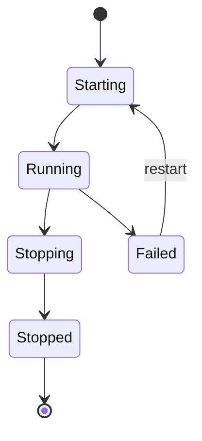

# Worker System — Skill Execution Runtimes

**Carnelian Core v1.0.0**

The `WorkerTransport` trait abstracts four runtimes (Node.js, Python, WASM, Native) behind a uniform interface. `WorkerManager` in `crates/carnelian-core/src/worker.rs` supervises worker processes, enforces resource limits, verifies attestations, and routes skill invocations across heterogeneous execution environments.

---

## Table of Contents

1. [Overview](#overview)
2. [JSONL Transport Protocol](#jsonl-transport-protocol)
3. [Process vs. HTTP Transport](#process-vs-http-transport)
4. [Worker Runtimes](#worker-runtimes)
5. [Worker Attestation](#worker-attestation)
6. [Worker Lifecycle](#worker-lifecycle)
7. [Resource Limits](#resource-limits)
8. [Skill Manifest Format](#skill-manifest-format)
9. [Capability Enforcement](#capability-enforcement)
10. [Writing Skills](#writing-skills)
11. [API Reference](#api-reference)

---

## Overview

```
┌──────────────────────────────────────────────────────────────┐
│                     Core Orchestrator                        │
│              WorkerManager (worker.rs)                       │
└────────────────────────┬─────────────────────────────────────┘
                         │  WorkerTransport trait
          ┌──────────────┼──────────────┬──────────────┐
          ▼              ▼              ▼              ▼
  ProcessJsonlTransport  WasmWorker    NativeWorker   PythonWorker
  (Node.js / Python)     Transport     Transport      Transport
  stdin/stdout JSONL     wasmtime 27   20 Rust ops    pip + JSONL
```

### WorkerRuntime Variants

Carnelian supports four execution runtimes, each represented by a `WorkerRuntime` enum variant:

| Runtime | Enum Variant | Transport | Description |
|---------|--------------|-----------|-------------|
| **Node.js** | `WorkerRuntime::Node` | `ProcessJsonlTransport` | JavaScript skills via Node.js process |
| **Python** | `WorkerRuntime::Python` | `PythonWorkerTransport` | Python skills via Python process |
| **WASM** | `WorkerRuntime::Wasm` | `WasmWorkerTransport` | WebAssembly skills via wasmtime 27 |
| **Native** | `WorkerRuntime::Native` | `NativeWorkerTransport` | Built-in Rust operations (20 ops) |

### WorkerTransport Trait

The `WorkerTransport` trait (lines 187–217 of `crates/carnelian-core/src/worker.rs`) defines five core methods:

```rust
#[async_trait]
pub trait WorkerTransport: Send + Sync {
    async fn invoke(&self, request: InvokeRequest) -> Result<InvokeResponse>;
    async fn stream_events(&self, run_id: RunId) -> Result<Receiver<StreamEvent>>;
    async fn cancel(&self, run_id: RunId, reason: String) -> Result<()>;
    async fn health(&self) -> Result<HealthResponse>;
    async fn shutdown(&self) -> Result<()>;
}
```

---

## JSONL Transport Protocol

The `ProcessJsonlTransport` uses newline-delimited JSON for inter-process communication. Each message is a single JSON object terminated by `\n`, written to the worker's stdin or read from stdout.

### TransportMessage Variants

Six message types are defined in `crates/carnelian-common/src/types.rs` (lines 613–641):

| Variant | Direction | Purpose |
|---------|-----------|---------|
| `Invoke` | Core → Worker | Start a skill execution |
| `Cancel` | Core → Worker | Cancel a running invocation |
| `Health` | Core → Worker | Health check request |
| `InvokeResult` | Worker → Core | Final execution result |
| `Stream` | Worker → Core | Streaming event / log line |
| `HealthResult` | Worker → Core | Health check response |

### Message Correlation

- **`message_id`** — UUIDv7 for request/response correlation
- **`run_id`** — Inside `InvokeRequest`/`InvokeResponse` for per-invocation tracking

### Output Limits

Workers enforce output size limits to prevent memory exhaustion:

- **`CARNELIAN_MAX_OUTPUT_BYTES`** environment variable
- **`skill_max_log_lines`** config field

Truncated responses include `"truncated": true` in the payload.

### StreamEventType Sub-Types

The `Stream` transport message contains a `StreamEventType` that categorizes the streaming data:

| Event Type | Purpose | Example Payload |
|------------|---------|----------------|
| `Log` | Log output from skill execution | `{"level": "info", "message": "Processing file..."}` |
| `Progress` | Percentage or stage updates | `{"percent": 45, "stage": "Analyzing"}` |
| `Artifact` | File produced during execution | `{"path": "/tmp/output.json", "size": 1024}` |

**Example Stream message with Progress:**

```json
{"type":"Stream","message_id":"01936a1b-...","payload":{"run_id":"01936a1c-...","event_type":"Progress","data":{"percent":45,"stage":"Analyzing"}}}
```

**Example Invoke message:**

```json
{"type":"Invoke","message_id":"01936a1b-...","payload":{"run_id":"01936a1c-...","skill_name":"file-read","input":{"path":"/tmp/test.txt"},"timeout_secs":60}}
```

---

## Process vs. HTTP Transport

### ProcessJsonlTransport

The primary implementation (lines 248–779 of `crates/carnelian-core/src/worker.rs`):

- **Owns the child process** — Takes `stdin`/`stdout` handles
- **Background demultiplexer** — `read_stdout_loop` task routes responses to per-run `oneshot` senders
- **Used by** — Node.js worker and Python worker (`crates/carnelian-worker-python/src/lib.rs`)

**Key features:**
- Async message passing via `tokio::sync::mpsc`
- Per-invocation timeout enforcement
- Graceful shutdown with SIGTERM → SIGKILL escalation

### HttpJsonTransport

**Status:** Planned future transport. Current codebase only ships `ProcessJsonlTransport`.

### Per-Worker Configuration

Relevant `Config` fields controlling transport behavior:

| Field | Description | Default |
|-------|-------------|---------|
| `skill_max_output_bytes` | Maximum output size per invocation | 1 MB |
| `skill_timeout_grace_period_secs` | Grace period before SIGKILL | 5 s |
| `skill_max_log_lines` | Maximum log lines per invocation | 10,000 |
| `http_port` | Core API port injected into workers as `CARNELIAN_API_URL` for callbacks | 18789 |

---

## Worker Runtimes

### Node.js

**Runtime:** `WorkerRuntime::Node` → `ProcessJsonlTransport`

- **Script:** `workers/node-worker/dist/index.js`
- **Spawn command:** `node workers/node-worker/dist/index.js`
- **Environment variables:**
  - `WORKER_ID` — Unique worker identifier
  - `CARNELIAN_API_URL` — Core API endpoint
  - `CARNELIAN_LEDGER_HEAD` — Expected ledger head hash
  - `CARNELIAN_CONFIG_VERSION` — Expected config version
- **Compatible skills:** 50+ Thummim-compatible skills from `skills/registry/`

### Python

**Runtime:** `WorkerRuntime::Python` → `PythonWorkerTransport` wrapping `ProcessJsonlTransport`

- **Script:** `workers/python-worker/worker.py`
- **Binary detection:** `detect_python_binary()` tries `python3` → `python` fallback
- **Pre-installation:** Runs `pip install -r workers/python-worker/requirements.txt` before first spawn
- **Protocol:** Same JSONL protocol as Node.js

### WASM

**Runtime:** `WorkerRuntime::Wasm` → `WasmWorkerTransport`

- **Execution:** In-process via `WasmSkillRuntime` backed by `wasmtime` v27 with WASI P1
- **Skill path:** `skills/core-registry/<name>/<name>.wasm`
- **Manifest:** `skills/core-registry/<name>/skill.json`
- **Timeout:** Epoch-based (30 s default)
- **Capabilities:** Filesystem/network access gated by `capabilities_required`
- **Authoring:** See [WASM_SKILLS.md](WASM_SKILLS.md)

### Native Ops

**Runtime:** `WorkerRuntime::Native` → `NativeWorkerTransport`

- **Execution:** In-process Rust; no child process
- **Operations:** 20 named operations dispatched by `skill_name` string

#### Native Operations Table

| Category | Operations | Capabilities |
|----------|-----------|--------------|
| **File** (7) | `file_read`, `file_write`, `file_delete`, `file_move`, `file_search`, `dir_list`, `file_hash` | `fs.read`, `fs.write` |
| **Git** (5) | `git_status`, `git_diff`, `git_commit`, `git_log`, `git_branch` | `git.read`, `git.write` |
| **Network** (2) | `http_get`, `http_post` | `network` |
| **Docker Read** (3) | `docker_ps`, `docker_logs`, `docker_stats` | `docker.read` |
| **Docker Exec** (1) | `docker_exec` | `docker.exec` |
| **System** (3) | `process_list`, `disk_usage`, `network_stats` | `system.read` |
| **Env** (1) | `env_get` | `env.read` |

#### Privileged Operations

The following write operations require owner approval signatures:
- `file_write`
- `file_delete`
- `git_commit`

These operations require:
1. Required capability granted
2. Ed25519 `_approval_signature` in request input
3. Signature verification via `verify_owner_approval()`

**Note:** `file_move` requires only `fs.write` capability without an approval signature.

**Authoring:** See [RUST_SKILL_SYSTEM.md](RUST_SKILL_SYSTEM.md)

---

## Worker Attestation

Worker attestation ensures that workers are running the expected code version and configuration. Implementation in `crates/carnelian-core/src/attestation.rs`.

### Attestation Flow

1. **Worker reports** — Each worker includes `WorkerAttestation` in its `HealthResult` payload:
   - `worker_id` — Unique worker identifier
   - `last_ledger_head` — Last known ledger head hash
   - `build_checksum` — BLAKE3 hash of worker binary
   - `config_version` — Configuration version string

2. **Orchestrator injects** — Expected values as environment variables at spawn time:
   - `CARNELIAN_LEDGER_HEAD`
   - `CARNELIAN_CONFIG_VERSION`

3. **Verification** — Compares all three fields; any mismatch sets `mismatch_reason` and triggers `quarantine_worker()`

4. **Quarantine** — Quarantined workers are denied new task assignments

5. **Ledger event** — Only attestation **failures** produce a ledger event (`"worker.quarantined"`). Successful attestations are recorded in the `worker_attestations` database table via `record_attestation()` but do not produce a ledger event. See [LEDGER_SYSTEM.md](LEDGER_SYSTEM.md).

6. **Cadence gating** — 5-minute minimum interval via `last_attestation_verified` on the `Worker` struct

### Database Schema

```sql
CREATE TABLE worker_attestations (
    worker_id         TEXT PRIMARY KEY,
    last_ledger_head  TEXT NOT NULL,
    build_checksum    TEXT NOT NULL,
    config_version    TEXT NOT NULL,
    attested_at       TIMESTAMPTZ DEFAULT NOW(),
    quarantined       BOOLEAN DEFAULT FALSE,
    quarantine_reason TEXT,
    quarantined_at    TIMESTAMPTZ
);
```

---

## Worker Lifecycle

The `WorkerManager` (struct defined at line 2106, methods spanning approximately lines 2125–3418 of `crates/carnelian-core/src/worker.rs`) manages the complete worker lifecycle.

### Lifecycle Stages

#### 1. Startup

`start_workers()` spawns workers up to `max_workers` limit. Each worker transitions through `WorkerStatus` states:

```
Starting → Running
```

#### 2. Health Check Loop

- **Frequency:** Every 30 seconds
- **Mechanism:** Calls `transport.health()` which sends a `Health` message
- **Timeout:** Waits up to 10 seconds for a `HealthResult`
- **Dead process detection:** Via `try_wait()`

#### 3. Attestation Check

- **Frequency:** Every 5 minutes (within health loop)
- **Action:** Triggers quarantine on mismatch

#### 4. Graceful Shutdown

1. `transport.shutdown()` cancels all active runs
2. `cancel_with_signal()` sends SIGTERM (Unix) or `kill()` (Windows)
3. Waits `skill_timeout_grace_period_secs`
4. Sends SIGKILL if process survives

#### 5. Crash Recovery

`WorkerManager` can restart failed workers. Status transitions to `Failed` on crash.

### WorkerStatus State Machine



---

## Resource Limits

Carnelian enforces multiple resource limits to prevent runaway executions.

| Limit | Source | Default |
|-------|--------|---------|
| **Output size** | `CARNELIAN_MAX_OUTPUT_BYTES` env / `skill_max_output_bytes` | 1 MB |
| **Log lines** | `skill_max_log_lines` Config field | 10000 |
| **Execution timeout** | `InvokeRequest.timeout_secs` per call | 300 s |
| **Timeout grace period** | `skill_timeout_grace_period_secs` | 5 s |
| **WASM epoch timeout** | `WasmSkillRuntime` `default_timeout_secs` | 30 s |
| **WASM memory pages** | `default_max_memory_pages` (64 MB) | 1024 pages |

**Note:** WASM memory limit is defined in code but not currently enforced at the wasmtime level (see [WASM_SKILLS.md](WASM_SKILLS.md)). CPU cap and container-level limits are not yet implemented.

---

## Skill Manifest Format

Skills declare their metadata, capabilities, and runtime requirements in manifest files.

### skill.json (WASM and Node.js)

Used by WASM and Node.js skills:

```json
{
  "name": "my-skill",
  "description": "...",
  "runtime": "wasm",
  "version": "1.0.0",
  "capabilities_required": ["fs.read", "network"]
}
```

### SKILL.md TOML Front-Matter (Native/Node)

Used by native and Node skills in `skills/registry/`:

```toml
[skill]
id = "my-skill"
name = "My Skill"
version = "1.0.0"
type = "node"   # node | wasm | native

[capabilities]
required = ["fs.read"]

[limits]
timeout_secs = 60
max_output_bytes = 524288
```

### Build Checksum

The `build_checksum` in attestation is computed as:

- **WASM:** BLAKE3 hash of the compiled `.wasm` binary
- **Node.js:** Reads `workers/node-worker/package.json` and returns `v{version}` (e.g., `v0.1.0`)
- **Python:** Returns `v{VERSION}` from `CARNELIAN_BUILD_CHECKSUM` env var or falls back to `v0.1.0`
- **Native:** BLAKE3 hash of the Rust source or compiled artifact

---

## Capability Enforcement

Capability enforcement is implemented in `crates/carnelian-core/src/policy.rs` (`PolicyEngine`) and verified by each transport.

### Pre-Dispatch Checks

Before skill execution, `PolicyEngine.check_task_execution()` verifies:

1. **Identity capability** — Identity has `task.create` capability
2. **Skill capabilities** — All capabilities in the skill's `capabilities_required` are granted to the skill subject

The intersection of **declared** (in manifest) vs **granted** (in `capability_grants` table) must be satisfied.

### Denial Handling

- Denials emit a `CapabilityDenied` event on the `EventStream`
- Event is logged to ledger
- Invocation returns error immediately

### WASM Host Function Gating

For WASM workers, `capabilities_required` additionally gates host-function access:

- `fs.read` / `fs.write` → Filesystem preopen
- `network` → `inherit_network()` in WASI config

### Capability Key Namespace

| Namespace | Keys | Runtime |
|-----------|------|---------|
| `fs` | `fs.read`, `fs.write` | Native, WASM |
| `git` | `git.read`, `git.write` | Native |
| `docker` | `docker.read`, `docker.exec` | Native |
| `system` | `system.read` | Native |
| `env` | `env.read` | Native |
| `net` | `network` | WASM |
| `task` | `task.create` | All (identity-level) |

---

## Writing Skills

### Quick Reference by Runtime

| Runtime | Entry point | Manifest | Output format | Docs |
|---------|------------|----------|---------------|------|
| **Node.js** | `index.js` (JSONL stdin/stdout) | `skill.json` | JSON on stdout | [RUST_SKILL_SYSTEM.md](RUST_SKILL_SYSTEM.md) |
| **Python** | `skill.py` (JSONL stdin/stdout) | `skill.json` | JSON on stdout | — |
| **WASM** | `invoke` or `_start` export; stdin→stdout | `skill.json` | JSON on stdout | [WASM_SKILLS.md](WASM_SKILLS.md) |
| **Native** | Built-in Rust match arm | Implicit | `serde_json::Value` | [RUST_SKILL_SYSTEM.md](RUST_SKILL_SYSTEM.md) |

### Skill Directory Layout

#### Node.js and WASM

```
skills/registry/<skill-name>/
├── skill.json
├── index.js          # Node.js
└── SKILL.md          # optional human docs

skills/core-registry/<skill-name>/
├── skill.json
└── <skill-name>.wasm # WASM
```

### Example Node.js Skill

**Note:** Skills are loaded as ES modules by the `SkillLoader` and must export an `invoke(input)` function. The JSONL protocol is handled internally by the worker.

**`skills/registry/hello-world/index.js`:**

```javascript
export async function invoke(input) {
  return {
    success: true,
    output: {
      greeting: `Hello, ${input.name}!`
    }
  };
}
```

**`skills/registry/hello-world/skill.json`:**

```json
{
  "name": "hello-world",
  "description": "Simple greeting skill",
  "runtime": "node",
  "version": "1.0.0",
  "capabilities_required": []
}
```

---

## API Reference

Skill management endpoints from the Carnelian REST API:

| Endpoint | Method | Description |
|----------|--------|-------------|
| `/v1/skills` | GET | List discovered skills with capabilities |
| `/v1/skills/{skill_id}/enable` | POST | Enable a skill |
| `/v1/skills/{skill_id}/disable` | POST | Disable a skill |
| `/v1/skills/refresh` | POST | Re-scan skill registry |
| `/v1/status` | GET | System status including worker count |

**Note:** Worker-specific endpoints (`/v1/workers/*`) are not currently exposed. Worker status is available via `GET /v1/status` which includes active worker count.

**Example: List skills**

```bash
curl http://localhost:18789/v1/skills \
  -H "X-Carnelian-Key: $KEY"
```

**Response:**

```json
{
  "skills": [
    {
      "skill_id": "file-read",
      "name": "File Read",
      "runtime": "native",
      "capabilities_required": ["fs.read"],
      "enabled": true
    }
  ]
}
```

---

## See Also

- **[WASM_SKILLS.md](WASM_SKILLS.md)** — WebAssembly skill authoring guide
- **[RUST_SKILL_SYSTEM.md](RUST_SKILL_SYSTEM.md)** — Native Rust skill development
- **[LEDGER_SYSTEM.md](LEDGER_SYSTEM.md)** — Audit trail for worker events
- **[API.md](API.md)** — Complete REST API reference

---

**Last Updated:** March 2026  
**Version:** 1.0.0
